# XFunNote — 小方的万用本

> **XFunNote** = e**X**ploratory **Fun**damental **Note**book  
> 小方的万用本，个人效率与 AI 助手的实验场。

---

## 项目简介

XFunNote 是一个个人知识管理与效率工具，核心目标是：

- 整合**各类碎片信息**为结构化条目，统一存储与管理
- 借助 **AI 自动生成日报/周报**，辅助每日复盘与决策
- 作为技术实验场：Python 工程化 + AI Agent + 快速原型开发

**当前阶段**：准大一暑假 MVP 开发中
**当前进度**：Python 核心引擎（xfun/）+ FastAPI 后端已完成，React 前端骨架就绪、页面填充中。

---

## 快速开始

```bash
# 1. 一键创建虚拟环境并安装依赖
chmod +x setup.sh && ./setup.sh

# 2. 激活虚拟环境
source .venv/bin/activate

# 3. （后端启动）在虚拟环境中运行
uvicorn backend.main:app --reload

# 4. （前端启动，另开终端）
cd frontend && npm install && npm run dev
```

---

## 配置

### 1. 环境变量

复制项目根目录的 `.env.example` 为 `.env` 并填写配置。

| 变量 | 说明 |
|------|------|
| `XFUN_USER` | 数据库用户名，拼接为 `data/{用户名}.db`。若未设置，默认回退为 `data/default.db` |
| `ROOT_TOKEN` | 管理员启动密钥（bootstrap），用于前期引导和数据库管理操作（`/db/*` 路由）。后续建议通过 `/api/v1/tokens` API 管理普通 Token |
| `LLM_API_KEY` | DeepSeek API Key，用于 AI 功能 |
| `LLM_BASE_URL` | DeepSeek API 端点，若不设置则为 None（ChatAnthropic 使用默认端点） |
| `LLM_MODEL` | 默认模型，若不设置则由 LangChain 默认决定（当前建议 `deepseek-v4-flash`） |

### 2. 数据库路径

数据库默认路径为 `data/{用户名}.db`，通过 `XFUN_USER` 自动拼接。  
SQLite 以 **WAL 模式**运行，支持并发读写不阻塞。

---

## 核心概念

### 数据模型

| 概念 | 说明 |
|------|------|
| **Notebook** | 数据容器基类，子类定义 `_extra_columns` 即可获得完整 CRUD + 筛选能力 |
| **Condition** | 单个筛选条件（`column op value`），支持通过 `Condition.register_op()` 注册自定义运算符（`JSON_CONTAINS`、`JSON_NOT_CONTAINS`、`TEXT_SEARCH`、`TRUE`、`FALSE` 等） |
| **Filter** | 递归结构：外层 `OR`，内层 `AND`，支持无限嵌套与整体取反，最终由 `to_sql()` 展开为 SQL WHERE |
| **View** | `dict[表名, list[(列名列表, 行筛选条件)]]` — 跨本子的数据子集描述。支持 `view_or`（并集）/ `view_and`（交集）/ `view_to_sql`（UNION ALL + 主键去重），通过 `view_to_json` / `parse_view_json` 序列化为 JSON。**用户可创建多份视图，快速切换不同的数据视角**（如"今日概览"、"本周回顾"、"待复习单词"） |
| **Permission** | `(read_view: View, write_view: View)` 元组，解耦"谁能看什么"和"谁能改什么"。系统内置 `root_permission()`（全权限，用于 CLI/管理接口）、`ai_permission()`（AI 安全沙箱）、`no_permission()`（零权限，默认拒绝）。**用户可自由组合新的 `(read_view, write_view)` 元组来创建不同访问身份** |
| **Ops** | 4 个高维操作函数 `query` / `add` / `update` / `delete`，接收 `Permission` + Notebook 类型 + 筛选条件，内部自动完成：`Permission → view_and 合并权限 → view_clean_* 清洗输入 → Notebook 底层 CRUD → 返回完整结果`。**View、Permission、Notebook 三者各司其职，Ops 担任编排角色** |

### 系统表

XFunNote 使用 3 张系统级数据库表来支撑 API 访问控制与视图管理：

| 系统表 | 说明 | 管理路由 |
|--------|------|---------|
| `_tokens` | API 鉴权 Token 表。每条记录包含 `token`（密钥值）、`permission`（绑定的权限标识）、`is_active`（启用/停用）、`expires_at`（过期时间） | `/api/v1/tokens` |
| `_permissions` | 权限定义表。每条记录包含 `id`（权限标识）、`name`/`description`、`read_view`/`write_view`（读写 View JSON） | `/api/v1/permissions` |
| `_views` | 视图持久化表。每条记录包含 `name`（视图名）、`data`（View JSON 内容） | `/api/v1/views` |

通过 `ROOT_TOKEN` 初始化后，使用 `/api/v1/tokens` 创建普通 API Key，每个 Key 绑定一个 `_permissions` 表中的权限定义。AI Chat 接口在运行时自动计算 **API Key 权限 ∩ AI 配置权限** 的交集，确保最小权限原则。

### AI 集成

| 概念 | 说明 |
|------|------|
| **权限体系** | `Permission = (read_view, write_view)` 身份系统，内置 root / ai / no 三种身份。AI 所有操作自动应用 `view_and` 交集约束，支持多角色切换 |
| **AI Tools** | `query_entries`、`add_entries`、`update_entries`、`delete_entries`、`get_ai_permission` 共 **5 个**工具（4 个 CRUD + 权限查询）。不同 AI 模式可绑定不同工具子集，实现能力分级 |
| **Agent** | `xfun/ai/agent.py` 工具调用循环引擎：支持多轮迭代（最多 10 轮）、自动错误恢复、System Prompt + 对话历史管理。<br><br>**流式输出体系**：支持三级流式粒度控制 `StreamLevel`（`TOKEN` / `MSG` / `SYNC`），通过 `accumulate_messages()` + `_chunk_to_message()` 自动将连续 `AIMessageChunk` 合并为完整 `AIMessage`。<br><br>**思考内容解析**：`extract_content_parts()` 解析 Anthropic 风格的 thinking blocks，将块内容按 type 分组为 `{"thinking": "...", "text": "..."}` 字典，在 CLI 中以灰色输出到 stderr。<br><br>**消息序列化**：`messages_to_json()` / `parse_messages_json()` 支持完整的 BaseMessage ↔ JSON 双向转换，对话历史可持久化到文件。<br><br>**SystemMessage 管理**：`ensure_system_message()` 自动在消息列表开头插入/替换 SystemMessage，支持多次对话复用同一提示词 |
| **多模式扩展** | 当前 AI 默认使用 `ai_permission()` + 5 个工具。未来可新增 `analyst`（只读）、`editor`（读写）、`manager`（全工具）等模式，各自绑定不同的 Permission + 工具集，通过 `agent_invoke(messages, permission=..., tools=...)` 参数化调用 |

### 记忆系统

| 概念 | 说明 |
|------|------|
| **aimemory** | 存储 AI 结构化记忆（标题 + 内容 + 标签） |
| **accumulation** | 存储通用知识积累 |
| **分散索引** | 各本子 `ai_tags`/`ai_note` 通过 `JSON_CONTAINS` / `TEXT_SEARCH` 运算符检索 |

---

## 架构设计

### 设计哲学

- **数据优先**：所有信息以条目（Entry）为单位存储，统一抽象为 `Notebook`，扩展列按需定义。
- **筛选驱动**：`Condition` + 递归 `Filter` 构成完整的查询 DSL，支持 AND/OR 嵌套、自定义运算符（`JSON_CONTAINS`、`LIKE` 等），全部下推 SQLite。
- **AI 原生**：AI 通过 Function Calling 调用 `query_entries`/`update_entries` 等安全工具，自动应用 `AI_READ_VIEW` 与 `AI_WRITE_VIEW` 行级/列级权限沙箱，杜绝越权操作。
- **权限即身份**：Permission 包含读/写两套独立的 View，天然支持多角色切换。系统内置 root / ai / no 三种身份，用户可自由组合新的 `(read_view, write_view)` 元组来创建"访客"、"协作者"、"管理员"等身份。每套 AI 模式可绑定不同的 Permission + 工具集，实现细粒度的能力分级。
- **记忆即数据**：用户偏好、AI 规则、分类体系均存储为 `accumulation` 和 `aimemory` 本子中的条目，通过 `ai_tags`/`ai_note` 分散索引。
- **本地优先**：单文件 SQLite + WAL 模式，零配置同步（iCloud/OneDrive/WebDAV 即可）。

### 核心架构决策

以下决策是 XFunNote 区别于普通"计划管理工具"的根本所在。

#### 1. 查询引擎：纯 SQL 下推，绝不内存过滤
- `Filter` 递归结构（外层 OR、内层 AND）通过 `to_sql()` 无损展开为一条 SQL。
- `view_to_sql` 同样完全下推 SQL：将 View 的 UNION ALL + GROUP BY 去重逻辑翻译为 SQL，不在 Python 侧做行合并。
- 所有自定义运算符（`JSON_CONTAINS`、`TEXT_SEARCH` 等）只注册一次 SQL 生成逻辑，永不重复实现 Python 等价逻辑。
- SQLite 优先走索引列（如 `month`、`done`）压缩数据量，再对少量数据执行 JSON/文本运算，性能充足。

#### 2. Permission + AI 安全沙箱：身份即权限

- **Permission 的设计定位**：`(read_view, write_view)` 不是"一个权限值"，而是"一个身份"。系统内置三个身份：

  | 身份 | 读权限 | 写权限 | 适用场景 |
  |------|--------|--------|---------|
  | `root_permission` | 全部表 × 全部列 × 无条件 | 同读权限 | CLI 命令、FastAPI 管理接口 |
  | `ai_permission` | 通用列 + 各本子专用列子集，排除含"私密"标签条目 | 仅 `content/ai_tags/ai_note` + 专用列子集 | AI 默认模式 |
  | `no_permission` | 零访问 | 零访问 | 默认拒绝兜底 |

- **写权限是读权限的子集**：`_AI_WRITE_FILTER` 定义为 `[[_AI_READ_FILTER, TRUE_CONDITION]]`，AI 可写行必须同时满足可读过滤条件（排除含"私密"标签的条目），杜绝越权修改。

- **用户可自由创建新身份**：只需构造新的 View 元组并调用 `ops.query(conn, (my_read_view, my_write_view), ...)` 即可。例如：
  - `guest_permission` — 限制为 `content` 和 `tags` 两列的只读权限
  - `shared_permission` — 限定 `plan` 本子中 `done=0` 的条目可见

- **AI 多模式扩展**：不同 AI 模式绑定不同 Permission + 工具集：
  | 模式 | 权限 | 工具集 | 用途 |
  |------|------|--------|------|
  | `analyst` | `(只读, no_permission)` | 仅 `query_entries` | 数据分析 |
  | `editor` | `(ai_read, ai_write)` | 全部 5 个工具 | 内容管理 |
  | `manager` | `(ai_read, ai_write)` | 全部 5 个工具 | 全功能 |
  - 此扩展无需修改 Ops 层、View 层或 Notebook 层

- **列级清洗**：通过 `view_clean_columns` 自动清洗非授权列（`id`、`created_at`、`seq` 等系统列受保护）。
- **安全删除**：删除操作必须经过"预览 → 确认"流程，禁止无条件删除。

#### 3. 记忆系统：显式记忆库（aimemory）+ 分散痕迹的统一检索
- 显式记忆存储在 `aimemory` 本子（专用于 AI 记忆沉淀，字段：title/content/source/note）。
- `accumulation` 本子用于用户的通用知识积累。
- 分散痕迹存储在各类条目的 `ai_tags` 和 `ai_note` 中，通过 `JSON_CONTAINS` / `TEXT_SEARCH` 运算符检索。
- **三级记忆分层**：`aimemory` 本子的 `title` 以 `[事实]`（客观属性）、`[历史]`（操作记录）或 `[策略]`（处理规则）为前缀。AI 执行任务前自动检索 `[策略]` 记忆作为默认配置，冲突时以用户当次指令为最高优先级。

#### 4. AI 日报闭环：从生成到交付的自动化
- AI 填充 LaTeX 模板 → 后端 `pdflatex` 编译（最多 3 次迭代纠错）→ 输出 PDF。
- 用户通过 QQ 反馈 → AI 调用 `save_memory` 固化偏好 → 次日日报自动适配。
- `cron` 定时触发 CLI，通过 QQ 机器人推送 PDF。

#### 5. 多视图：数据视角的持久化

- View 是可序列化的 JSON 结构，通过 `view_to_json()` / `parse_view_json()` 可在系统内部传递。
- 视图存储在数据库 `_views` 表中，通过 RESTful API 管理（`/api/v1/views`）：
  - `GET /views` — 列出所有视图
  - `GET /views/{name}` — 获取单个视图
  - `PUT /views/{name}` — 创建/更新视图
  - `DELETE /views/{name}` — 删除视图
- 用户可创建多份视图，例如：
  - `view_daily` — "今日概览"（plan 本子当月 + diary 本子当天）
  - `view_weekly` — "本周回顾"（plan 本子当月 `done=1` + diary 本周）
  - `view_word_review` — "待复习单词"（word 本子 `next_review <= 今天`）
- `view_or` / `view_and` 支持对已有视图做布尔组合，构建更复杂的跨本子数据子集。

### 模块详解

| 模块 | 职责 | 子模块 |
|------|------|--------|
| `xfun/core/` | 核心引擎 — 数据库抽象层、筛选查询 DSL、Notebook 基类、View 数据水合、Ops 操作层 | `db.py` / `filter.py` / `view.py` / `notebook.py` / `ops.py` / `errors.py` / `extras.py` |
| `xfun/notebooks/` | 内置本子 — 现有 5 种（`plan`/`diary`/`word`/`accumulation`/`aimemory`），规划新增 `timeline` + `schedule` | `plan.py` / `diary.py` / `word.py` / `accumulation.py` / `aimemory.py` |
| `xfun/ai/` | AI 集成层 — 安全沙箱、CRUD Tools、Agent 引擎、提示词与 Schema 校验 | `tools.py` / `agent.py` / `security.py` / `schema.py` / `prompts.py` |
| `xfun/utils/` | 工具函数 | `time_utils.py` |
| `xfun/` (根) | 集中配置管理 + Token/权限/视图服务 | `config.py` / `permission_service.py` / `token_service.py` / `view_service.py` |
| `cli.py` | 命令行入口（Typer, 10 个命令） | — |
| `tests/` | 测试套件 | 19 个文件 |
| `backend/` | FastAPI 后端（已实现） | `main.py` / `routers/`(notebooks/ai/manage_db/manage_views/manage_tokens/manage_permissions) / `services/` / `schemas.py` / `deps.py` / `permissions.py` |
| `frontend/` | Vite + React 前端（骨架开发中） | `src/pages/`(9 个页面待填充) / `src/components/`(10 个 UI 组件待填充) / `src/api/`(5 个 API 模块待填充) / `src/stores/` / `src/types/` |

### CLI `ai` 命令详解

AI 对话支持两种模式，`stdout` 统一输出完整消息列表 JSON：

| 子命令 | 说明 |
|--------|------|
| `xfun ai sync --messages JSON` | **同步模式**：静默调用 LLM，无终端输出，仅 stdout 输出 JSON。适合脚本集成和自动化 |
| `xfun ai chat` | **交互模式**：`stderr` 流式输出 LLM 回复（思考内容以灰色显示），退出后 stdout 输出完整消息 JSON |

**全局参数：**

| 参数 | 默认值 | 说明 |
|------|--------|------|
| `--messages, -m` | `None` | 消息历史 JSON 数组（仅 sync 模式必需） |
| `--max-iterations, -n` | `10` | Agent 工具调用最大迭代轮次 |
| `--system-prompt, --sp` | 默认提示词 | 自定义系统提示词 |
| `--llm-kwargs` | `{"thinking": {"type": "disabled"}}` | LLM 额外参数 JSON 字典 |

> **💡 开发调试**：`cli.py` 中的 `_AI_TOOLS` 变量管理着 AI 绑定的工具集，当前包含全部 5 个工具（4 个 CRUD + `get_ai_permission` 权限查询）。可按需增删工具来定制不同 AI 模式的能力。

### 技术栈

| 类别 | 选择 |
|------|------|
| 数据库 | SQLite（WAL 模式，读写分离事务） |
| CLI 框架 | Typer |
| AI | LangChain + DeepSeek API（通过 `langchain_anthropic.ChatAnthropic` 兼容层，完整支持 thinking blocks） |
| 数据模型 | Pydantic（JSON Schema 生成与 AI 输入校验） |
| 测试 | pytest + pytest-cov |
| 后端 API | FastAPI（已实现） |
| 前端/界面 | React 18 + TypeScript + Tailwind CSS（骨架开发中） |
| 前端构建 | Vite |
| 状态管理 | Zustand |
| 语言 | Python 3.10+ + TypeScript 5.x |

---

## 路线图

### 功能路线图

#### ✅ 已完成

| 模块 | 说明 |
|------|------|
| **数据库引擎** | 基于原生 `sqlite3`，安全参数化查询。支持 `Column` 列定义、`Condition` 筛选条件（内置 =/!=/>/</>=/<=/IN/NOT IN/BETWEEN/LIKE/NOT LIKE 及自定义运算符扩展：`JSON_CONTAINS`、`JSON_NOT_CONTAINS`、`TEXT_SEARCH`、`TRUE`、`FALSE`）、递归 `Filter` 结构（外层 OR 内层 AND）、读写分离事务（写 IMMEDIATE、读不阻塞） |
| **Notebook 体系** | 抽象基类封装通用 CRUD + 自动建表 + 批量操作，子类只需定义扩展列和自动填充逻辑 |
| **内置本子** | 基于基类扩展的 5 种预置实现 — 计划（字母编号/月分组）、日记（日期维）、单词（复习跟踪/去重）、积累（分类积累）、AI 记忆（标题/来源/备注）。各子类仅需定义扩展列和自动填充逻辑即可获得完整 CRUD + 批量操作 + 筛选查询，通过 dict 注册可插拔扩展 |
| **注册中心** | 通过 `dict` 管理所有 Notebook 实例，支持注册/查找/注销/迭代 |
| **AI Tools 层（核心）** | `xfun/ai/tools.py` 5 个 Function Calling 工具（`query_entries`、`add_entries`、`update_entries`、`delete_entries`、`get_ai_permission`）+ `xfun/ai/security.py` 行级/列级安全沙箱（`AI_READ_VIEW`、`AI_WRITE_VIEW`）+ `xfun/ai/schema.py` Pydantic JSON Schema 双重校验 + `xfun/ai/prompts.py` 系统提示词 |
| **Agent 对话引擎** | `xfun/ai/agent.py` 工具调用循环（Tool Calling Loop），支持多轮工具调用、自动错误恢复、最大迭代控制（10 轮） |
| **Ops 操作层** | `xfun/core/ops.py` 4 个高维 CRUD 函数（`query`/`add`/`update`/`delete`），封装 View + Notebook 的组合语义 |
| **视图层** | `xfun/core/view.py` 6 个核心函数：`view_to_sql`（跨本子 UNION ALL + 主键去重）、`view_or`/`view_and`（并集/交集）、`view_clean_columns`/`view_clean_filter`/`view_clean_update`（AI 安全沙箱列/行清洗）、`view_to_json`/`parse_view_json`（序列化/反序列化） |
| **测试覆盖** | 全面覆盖核心引擎及 AI 集成层正常路径、边界条件、错误路径及事务回滚，287 个单元测试，18 个测试文件（含 `test_ai_agent.py`、`test_ai_prompts.py`、`test_ai_schema.py`、`test_ai_security.py`、`test_ai_tools.py`），覆盖率 100% |

#### 🗺️ 规划中

按优先级分三个梯队：

**🚀 第一梯队（近期）**
- **FastAPI 后端** — `backend/main.py` 暴露 RESTful 接口（✅ 已实现）
- **React 前端** — `frontend/src/` 可视化界面（骨架就绪）
- **`timeline` + `schedule` 本子** — 时间线与日程表，配套三种视图（日/周/月）
- **三档 AI 模式** — 白板 / 查询 / 读写，精确控制 AI 数据访问深度

**📡 第二梯队（中期）**
- **AI 日报闭环** — `xfun/ai/daily.py` 拉取当日数据，调用 DeepSeek 生成结构化摘要，支持 LaTeX 编译
- **记忆导入与持续学习** — 导入外部数据（AI 对话导出、Markdown 笔记等），自动提炼标签与记忆总结
- **QQ 机器人推送** — 集成 go-cqhttp HTTP API，定时推送日报

**🔭 第三梯队（远期）**
- **工具函数补全** — `file_utils.py`、`string_utils.py`
- **单词复习调度** — SM-2 间隔重复算法集成
- **多端同步** — 数据库文件置于 iCloud/OneDrive/WebDAV

### 开发路线图与后续演进

以下路线图按开发顺序排列，每项均可在当前架构上独立增量实现。

#### 阶段零：核心收尾（已完成）
- [x] `Condition` 自定义运算符注册机制（`JSON_CONTAINS`、`LIKE`、`BETWEEN` 等）
- [x] `Filter` 递归 `to_sql()`，支持无限嵌套 OR/AND + `negate`
- [x] `Notebook` 基类抽象 + 5 个本子（`plan`、`word`、`diary`、`accumulation`、`aimemory`）
- [x] SQLite 数据库引擎（Column / Condition / Filter / DB / View）
- [x] 单元测试 287 个，覆盖率 100%

#### 阶段一：AI Tools 层（已完成）
- [x] 在 `xfun/ai/tools.py` 中实现 5 个工具：
  - `query_entries`（只读，自动合并 `AI_READ_VIEW`）
  - `update_entries`（可写，自动合并 `AI_WRITE_VIEW` + 列白名单）
  - `add_entries`（自动注入 `is_ai_gen=1`）
  - `delete_entries`（强制安全条件 + 预览拦截）
  - `get_ai_permission`（返回当前 AI 可读/可写字段的完整权限白名单）
- [x] 在 `xfun/ai/security.py` 中定义：
  - `AI_READ_VIEW`（行级读权限 View 白名单）
  - `AI_WRITE_VIEW`（行级写权限 View 白名单）
- [x] 在 `xfun/ai/schema.py` 中实现 Pydantic 模型（`ConditionModel`、`FilterModel`、`TableSpecModel`、`ViewModel`），为 AI 提供 JSON Schema 格式校验 + 运算符枚举校验
- [x] 在 `xfun/ai/prompts.py` 中定义 AI 系统提示词
- [x] `agent.py` 工具调用循环实现（LLM 绑定 5 个 Tools，多轮循环 + 自动错误恢复 + 最大迭代控制）
- [x] `cli.py` 命令行入口（Typer），完整实现 10 个命令（list / schema / query / add / update / delete / ai / init / backup / reset），已接入 Agent 对话引擎

#### 阶段二：View 层（已完成）
- [x] 实现 `xfun/core/view.py`，6 个核心函数：
  - `view_to_sql` — 跨本子 UNION ALL + GROUP BY 主键去重，全部下推 SQLite
  - `view_or` / `view_and` — View 的并集/交集操作（安全沙箱通过交集自动约束 AI 权限范围）
  - `view_clean_columns` / `view_clean_filter` / `view_clean_update` — AI 安全沙箱的列/行清洗工具（自动应用列白名单 + 行筛选）
  - `view_to_json` / `parse_view_json` — View 的序列化与反序列化
- [x] 在 `xfun/ai/schema.py` 中定义 `ViewModel`，通过 Pydantic 为 View JSON 格式提供双重校验

#### 阶段三：FastAPI 后端（✅ 已完成）
- [x] 实现 `backend/main.py`：
  - [x] 路由：`/api/v1/notebooks/{name}/entries`（`GET`/`POST`/`PUT`/`DELETE`）
  - [x] 路由：`/api/v1/ai/chat`（AI 对话，支持 `permission_name`/`tool_names`/`llm_kwargs`）
  - [x] 路由：`/api/v1/ai/permission`（AI 权限查询）
  - [x] 路由：`/api/v1/views/` 视图管理（CRUD，基于 `_views` 表）
  - [x] 路由：`/api/v1/tokens/` Token 管理（CRUD）
  - [x] 路由：`/api/v1/permissions/` 权限管理（CRUD）
  - [x] 路由：`/api/v1/db/init` / `backup` / `reset`（需 `ROOT_TOKEN`）
  - [x] Pydantic Schemas 映射（`ConditionModel` ↔ `Condition`）
- [x] API Key 鉴权体系（`deps.py`）：
  - [x] `X-API-Key` Header 鉴权
  - [x] `ROOT_TOKEN` bootstrap 机制（环境变量配置）
  - [x] `_tokens` 表查询 + 有效性校验（active / expired）
  - [x] 权限交集：`API Key 权限 ∩ AI 配置权限`
- [x] 依赖注入 + CORS 配置
- [x] 全局异常处理器（HTTPException / XFunError / RequestValidationError / 兜底 500）
- [x] 启动：`uvicorn backend.main:app --reload`（已验证可运行）
- [ ] 路由：`/api/v1/ai/daily`（日报生成，待实现）
- [ ] 路由：`/api/v1/ai/memory`（记忆查询与保存，待实现）

#### 阶段四：前端可视化（开发中）
- [ ] React 界面 `frontend/src/`：
  - 计划列表/筛选/增删改
  - 日记时间线
  - AI 对话界面
  - 日报查看/导出
- [ ] 调用 FastAPI 后端（而非直接操作数据库）

#### 阶段五：AI 日报闭环（核心 AI 功能）
- [ ] 实现 `xfun/ai/daily.py`：
  - `generate_daily_report()` — 拉取当日计划/单词/积累，调用 DeepSeek 生成结构化摘要
  - 支持 **LaTeX 模板填充** + **迭代编译**（`pdflatex`，最多重试 3 次，失败回退纯文本）
- [ ] 实现 `xfun/ai/latex.py`：
  - `compile_latex(content: str) -> (pdf_path, error_log)` — 临时目录编译，超时保护
- [ ] 实现用户反馈学习：
  - 用户在 QQ 中反馈意见 → AI 调用 `save_memory` 存储偏好到 aimemory 本子
  - 下次生成日报时，AI 先查询 `aimemory` 中 tags 含 `日报` 的记忆，自动调整模板

#### 阶段六：记忆导入与持续学习
- [ ] 实现 `xfun/ai/importers/` 模块：
  - `chatgpt.py` — ChatGPT 对话导出解析
  - `markdown.py` — 个人 Markdown 笔记批量导入
  - `txt.py` — 纯文本文件导入
- [ ] 实现 `xfun/ai/learner.py`：
  - 扫描未处理的导入条目，自动生成 `ai_tags`
  - 将多条相关条目提炼为一条 `save_memory` 总结
- [ ] 实现 `xfun/ai/chat.py`：
  - 命令行聊天界面，支持持续对话
  - 对话结束后自动调用 `save_memory` 保存关键结论
- [ ] CLI 命令手动触发学习任务

#### 阶段七：推送与定时任务
- [ ] 集成 QQ 机器人（HTTP API 客户端）：
  - 通过 `go-cqhttp` 或 `mirai` 接收推送
  - 在 `config.py` 中配置 `QQ_GROUP_ID` / `QQ_USER_ID`
- [ ] 配置 Cron 定时任务

#### 阶段八：多端同步与扩展（远期）
- [ ] `import/export` 命令：JSON 导入导出（已有 `add` 支持 JSON，`dump` 只需 `SELECT *` + `json.dump`）
- [ ] 多账户支持：`--user` 参数切换数据库文件
- [ ] 多端同步：数据库文件置于 iCloud/OneDrive/WebDAV（由用户自行配置）
- [ ] 移动端网页：React 前端部署（或 Tailscale 内网穿透）

#### 阶段九：新本子扩展
- [ ] `timeline` 本子 — 时间线记录，精确到分钟
- [ ] `schedule` 本子 — 日程安排，支持周期性重复
- [ ] 日/周/月三种网格可视化视图

#### 阶段十：三档 AI 模式
- [ ] 白板模式（零工具，纯对话）
- [ ] 查询模式（仅只读工具）
- [ ] 读写模式（完整 CRUD）
- [ ] 模式切换的用户界面

#### 阶段十一：临时层系统
- [ ] 对话消息暂存区（暂态存储）
- [ ] 消息编辑/删除/复制/分支/合并
- [ ] 版本快照与回退
- [ ] 即兴实验（修改临时层 → 观察 AI 反应 → 丢弃或提交）

#### 阶段十二：零散信息整合
- [ ] 外部数据导入接口（JSON/Markdown/链接）
- [ ] `accumulation` 本子按 `category` 分类管理
- [ ] 统一检索入口

#### 阶段十三：本地优先部署完善
- [ ] 手机端一键启动脚本
- [ ] Tailscale/ZeroTier 安全隧道指南
- [ ] 飞行模式兼容性验证

### 远期蓝图：XFunNote 的终极定位

以下描述 XFunNote 的长期设计愿景，不属于任何具体开发阶段，而是贯穿全局的演进方向。

#### 本地优先 + 手机即服务器

XFunNote 以手机或电脑为服务器，运行于本地局域网。所有数据存储于设备本地 SQLite 文件中，无需公网 IP、无需域名、无需云服务订阅。

- **访问方式**：同一 WiFi 下的任何设备（电脑、平板、其他手机）通过浏览器访问 `http://手机IP:端口` 即可使用。
- **飞行模式可用**：即使无网络，手机自身仍可通过 `http://127.0.0.1` 访问服务，数据永不丢失。
- **长期价值**：这种部署模型保证了数据的**永久可访问性**和**完全的隐私控制**，不受第三方平台政策变更或服务停用的影响。
- **三端统一**：

| 端 | 访问方式 |
|----|----------|
| **手机** | `http://localhost:8000` |
| **电脑/平板** | `http://手机IP:8000`（同一局域网） |
| **其他设备** | 通过 Tailscale/ZeroTier 安全访问 |

#### AI 的"懂你"能力从何而来

XFunNote 的 AI 能够产生"共情式"的个性化评论，不是因为它更聪明，而是因为它能读取的数据维度更完整：

| 数据来源 | 提供的维度 | AI 能感知到 |
|----------|-----------|------------|
| `plan` | 意图 | 你想做什么 |
| `timeline` + `schedule` | 行为 | 你实际做了什么 |
| `diary` | 感受 | 你怎么看待你做的 |
| `word` | 输入 | 你在学什么 |
| `accumulation` | 碎片思考 | 你记住了什么 |
| `aimemory` | 系统记忆 | AI 已经理解了什么 |

当这些数据在同一个系统里沉淀足够长时间后，AI 能够自然地感知到时间跨度、感情变化、生活细节，产生"共情式"的个性化反馈。

#### 临时层的终极形态

**临时层（暂存区）** 是 XFunNote 最独特的核心能力——对话历史的版本控制。用户不再被"线性不可逆"的对话束缚，而是可以：

| 能力 | 说明 |
|------|------|
| **非线性对话** | 回到任意对话节点，分支出新路径 |
| **历史编辑** | 修改过去的消息，AI 重新生成后续回复 |
| **分支合并** | 合并两条对话分支 |
| **版本快照** | 保存完整状态为快照，随时回退 |
| **即兴实验** | 编辑临时层做实验，不满意直接丢弃 |

所有变更在暂存区中生效，不直接写入永久存储。这使得 AI 对话从**被动接收指令**转变为**用户主动编排历史**。

#### 总结：XFunNote 是一个容器

XFunNote 不是"一个管理计划的 App"，而是**一个能够容纳个人全部时间、记忆、对话、知识、零散信息的容器**。它通过本地优先的数据主权、统一的数据模型（Notebook + Entry + View）、可选的 AI 深度（三档模式）、可编辑的对话历史（临时层），以及外部信息的统一收容与检索，让用户从"被工具限制"转变为**"掌控自己的数据与对话"**。它的终极形态不是"更好的计划工具"，而是 **"你放在自己手机上的、能和你一起成长的个人数据与 AI 操作系统"**。

---

## 项目结构

### 项目结构（自动生成）

<!-- begin project tree -->
```
XFunNote/
├── backend/
│   ├── routers/
│   │   ├── __init__.py
│   │   ├── ai.py
│   │   ├── manage_db.py
│   │   ├── manage_permissions.py
│   │   ├── manage_tokens.py
│   │   ├── manage_views.py
│   │   └── notebooks.py
│   ├── services/
│   │   ├── __init__.py
│   │   ├── ai_service.py
│   │   ├── management_service.py
│   │   └── notebook_service.py
│   ├── __init__.py
│   ├── deps.py
│   ├── main.py
│   ├── permissions.py
│   └── schemas.py
├── data/
│   └── backups/
│       └── .gitkeep
├── frontend/
│   ├── public/
│   │   └── vite.svg
│   ├── src/
│   │   ├── api/
│   │   │   ├── ai.ts
│   │   │   ├── client.ts
│   │   │   ├── management.ts
│   │   │   ├── notebooks.ts
│   │   │   └── views.ts
│   │   ├── components/
│   │   │   ├── layout/
│   │   │   │   ├── Layout.tsx
│   │   │   │   └── Sidebar.tsx
│   │   │   ├── notebook/
│   │   │   │   ├── FilterPanel.tsx
│   │   │   │   ├── NotebookCard.tsx
│   │   │   │   ├── NotebookForm.tsx
│   │   │   │   └── Pagination.tsx
│   │   │   └── ui/
│   │   │       ├── badge.tsx
│   │   │       ├── button.tsx
│   │   │       ├── card.tsx
│   │   │       ├── checkbox.tsx
│   │   │       ├── input.tsx
│   │   │       ├── select.tsx
│   │   │       ├── separator.tsx
│   │   │       └── textarea.tsx
│   │   ├── lib/
│   │   │   └── utils.ts
│   │   ├── pages/
│   │   │   ├── AiChat.tsx
│   │   │   ├── Home.tsx
│   │   │   ├── Management.tsx
│   │   │   ├── NotebookAccumulation.tsx
│   │   │   ├── NotebookAimemory.tsx
│   │   │   ├── NotebookDiary.tsx
│   │   │   ├── NotebookPlan.tsx
│   │   │   ├── NotebookWord.tsx
│   │   │   └── ViewManagement.tsx
│   │   ├── stores/
│   │   │   ├── chatStore.ts
│   │   │   └── notebookStore.ts
│   │   ├── types/
│   │   │   ├── api.ts
│   │   │   ├── filter.ts
│   │   │   ├── notebook.ts
│   │   │   └── view.ts
│   │   ├── App.tsx
│   │   ├── index.css
│   │   ├── main.tsx
│   │   └── vite-env.d.ts
│   ├── index.html
│   ├── package-lock.json
│   ├── package.json
│   ├── postcss.config.js
│   ├── tailwind.config.ts
│   ├── tsconfig.json
│   ├── tsconfig.node.json
│   └── vite.config.ts
├── input/
│   └── .gitkeep
├── output/
│   └── .gitkeep
├── scripts/
│   ├── project_info.py
│   ├── replace.py
│   └── updateREADME.sh
├── tests/
│   ├── __init__.py
│   ├── conftest.py
│   ├── test_accumulation.py
│   ├── test_ai_agent.py
│   ├── test_ai_prompts.py
│   ├── test_ai_schema.py
│   ├── test_ai_tools.py
│   ├── test_aimemory.py
│   ├── test_db.py
│   ├── test_diary.py
│   ├── test_extras.py
│   ├── test_filter.py
│   ├── test_notebook.py
│   ├── test_ops.py
│   ├── test_plan.py
│   ├── test_registry.py
│   ├── test_time_utils.py
│   ├── test_view.py
│   └── test_word.py
├── views/
│   └── .gitkeep
├── xfun/
│   ├── ai/
│   │   ├── __init__.py
│   │   ├── agent.py
│   │   ├── prompts.py
│   │   ├── schema.py
│   │   └── tools.py
│   ├── core/
│   │   ├── __init__.py
│   │   ├── db.py
│   │   ├── errors.py
│   │   ├── extras.py
│   │   ├── filter.py
│   │   ├── notebook.py
│   │   ├── ops.py
│   │   └── view.py
│   ├── notebooks/
│   │   ├── __init__.py
│   │   ├── accumulation.py
│   │   ├── aimemory.py
│   │   ├── diary.py
│   │   ├── plan.py
│   │   └── word.py
│   ├── utils/
│   │   ├── __init__.py
│   │   └── time_utils.py
│   ├── __init__.py
│   └── config.py
├── .env.example
├── .gitattributes
├── .gitignore
├── cli.py
├── LICENSE
├── README.md
├── requirements.txt
└── setup.sh
```
<!-- end project tree -->

### 依赖关系图（自动生成）

```mermaid
graph LR
    subgraph scripts[scripts]
        scripts_project_info(project_info)
        scripts_replace(replace)
    end
    style scripts fill:#d4f0c0,stroke:#333,stroke-width:1px,color:#333
    subgraph xfun_utils[xfun/utils]
        xfun_utils___init__(__init__)
        xfun_utils_time_utils(time_utils)
    end
    style xfun_utils fill:#e8f4fd,stroke:#333,stroke-width:1px,color:#333
    subgraph backend[backend]
        backend___init__(__init__)
        backend_deps(deps)
        backend_main(main)
        backend_permissions(permissions)
        backend_schemas(schemas)
    end
    style backend fill:#ffe0f0,stroke:#333,stroke-width:1px,color:#333
    subgraph backend_routers[backend/routers]
        backend_routers___init__(__init__)
        backend_routers_ai(ai)
        backend_routers_manage_db(manage_db)
        backend_routers_manage_permissions(manage_permissions)
        backend_routers_manage_tokens(manage_tokens)
        backend_routers_manage_views(manage_views)
        backend_routers_notebooks(notebooks)
    end
    style backend_routers fill:#f0e6ff,stroke:#333,stroke-width:1px,color:#333
    subgraph backend_services[backend/services]
        backend_services___init__(__init__)
        backend_services_ai_service(ai_service)
        backend_services_management_service(management_service)
        backend_services_notebook_service(notebook_service)
    end
    style backend_services fill:#fff3cd,stroke:#333,stroke-width:1px,color:#333
    subgraph _[.]
        cli(cli)
    end
    style _ fill:#ffe0e0,stroke:#333,stroke-width:1px,color:#333
    subgraph tests[tests]
        tests___init__(__init__)
        tests_conftest(conftest)
        tests_test_accumulation(test_accumulation)
        tests_test_ai_agent(test_ai_agent)
        tests_test_ai_prompts(test_ai_prompts)
        tests_test_ai_schema(test_ai_schema)
        tests_test_ai_tools(test_ai_tools)
        tests_test_aimemory(test_aimemory)
        tests_test_db(test_db)
        tests_test_diary(test_diary)
        tests_test_extras(test_extras)
        tests_test_filter(test_filter)
        tests_test_notebook(test_notebook)
        tests_test_ops(test_ops)
        tests_test_plan(test_plan)
        tests_test_registry(test_registry)
        tests_test_time_utils(test_time_utils)
        tests_test_view(test_view)
        tests_test_word(test_word)
    end
    style tests fill:#d5f5e3,stroke:#333,stroke-width:1px,color:#333
    subgraph xfun[xfun]
        xfun___init__(__init__)
        xfun_config(config)
    end
    style xfun fill:#fdebd0,stroke:#333,stroke-width:1px,color:#333
    subgraph xfun_ai[xfun/ai]
        xfun_ai___init__(__init__)
        xfun_ai_agent(agent)
        xfun_ai_prompts(prompts)
        xfun_ai_schema(schema)
        xfun_ai_tools(tools)
    end
    style xfun_ai fill:#d6eaf8,stroke:#333,stroke-width:1px,color:#333
    subgraph xfun_core[xfun/core]
        xfun_core___init__(__init__)
        xfun_core_db(db)
        xfun_core_errors(errors)
        xfun_core_extras(extras)
        xfun_core_filter(filter)
        xfun_core_notebook(notebook)
        xfun_core_ops(ops)
        xfun_core_view(view)
    end
    style xfun_core fill:#e8daef,stroke:#333,stroke-width:1px,color:#333
    subgraph xfun_notebooks[xfun/notebooks]
        xfun_notebooks___init__(__init__)
        xfun_notebooks_accumulation(accumulation)
        xfun_notebooks_aimemory(aimemory)
        xfun_notebooks_diary(diary)
        xfun_notebooks_plan(plan)
        xfun_notebooks_word(word)
    end
    style xfun_notebooks fill:#d4f0c0,stroke:#333,stroke-width:1px,color:#333
    backend_deps --> backend_permissions
    backend_deps --> xfun___init__
    backend_deps --> xfun_config
    backend_deps --> xfun_core___init__
    backend_deps --> xfun_core_filter
    backend_deps --> xfun_core_ops
    backend_deps --> xfun_core_view
    backend_deps --> xfun_utils_time_utils
    backend_main --> backend_routers___init__
    backend_main --> backend_routers_ai
    backend_main --> backend_routers_manage_db
    backend_main --> backend_routers_manage_permissions
    backend_main --> backend_routers_manage_tokens
    backend_main --> backend_routers_manage_views
    backend_main --> backend_routers_notebooks
    backend_main --> xfun_config
    backend_main --> xfun_core_errors
    backend_permissions --> xfun___init__
    backend_permissions --> xfun_core___init__
    backend_permissions --> xfun_core_filter
    backend_permissions --> xfun_core_ops
    backend_permissions --> xfun_core_view
    backend_routers_ai --> backend_deps
    backend_routers_ai --> backend_permissions
    backend_routers_ai --> backend_services___init__
    backend_routers_ai --> backend_services_ai_service
    backend_routers_ai --> xfun_core_view
    backend_routers_manage_db --> backend_services___init__
    backend_routers_manage_db --> backend_services_management_service
    backend_routers_manage_db --> xfun_config
    backend_routers_manage_permissions --> backend_deps
    backend_routers_manage_permissions --> backend_permissions
    backend_routers_manage_permissions --> xfun___init__
    backend_routers_manage_permissions --> xfun_core___init__
    backend_routers_manage_permissions --> xfun_core_filter
    backend_routers_manage_permissions --> xfun_core_ops
    backend_routers_manage_permissions --> xfun_core_view
    backend_routers_manage_tokens --> backend_deps
    backend_routers_manage_tokens --> backend_permissions
    backend_routers_manage_tokens --> xfun___init__
    backend_routers_manage_tokens --> xfun_core___init__
    backend_routers_manage_tokens --> xfun_core_filter
    backend_routers_manage_tokens --> xfun_core_ops
    backend_routers_manage_tokens --> xfun_core_view
    backend_routers_manage_views --> backend_deps
    backend_routers_manage_views --> backend_permissions
    backend_routers_manage_views --> xfun___init__
    backend_routers_manage_views --> xfun_core___init__
    backend_routers_manage_views --> xfun_core_filter
    backend_routers_manage_views --> xfun_core_ops
    backend_routers_manage_views --> xfun_core_view
    backend_routers_notebooks --> backend_deps
    backend_routers_notebooks --> backend_permissions
    backend_routers_notebooks --> backend_schemas
    backend_routers_notebooks --> backend_services___init__
    backend_routers_notebooks --> backend_services_notebook_service
    backend_routers_notebooks --> xfun_ai_schema
    backend_services_ai_service --> backend_permissions
    backend_services_ai_service --> xfun_ai_agent
    backend_services_ai_service --> xfun_ai_prompts
    backend_services_ai_service --> xfun_ai_tools
    backend_services_ai_service --> xfun_core_view
    backend_services_management_service --> xfun___init__
    backend_services_notebook_service --> xfun___init__
    backend_services_notebook_service --> xfun_core___init__
    backend_services_notebook_service --> xfun_core_filter
    backend_services_notebook_service --> xfun_core_ops
    backend_services_notebook_service --> xfun_core_view
    cli --> xfun___init__
    cli --> xfun_ai_agent
    cli --> xfun_ai_prompts
    cli --> xfun_ai_tools
    cli --> xfun_core_filter
    cli --> xfun_core_ops
    cli --> xfun_core_view
    tests_conftest --> xfun_core_db
    tests_conftest --> xfun_core_notebook
    tests_conftest --> xfun_notebooks_accumulation
    tests_conftest --> xfun_notebooks_aimemory
    tests_conftest --> xfun_notebooks_diary
    tests_conftest --> xfun_notebooks_plan
    tests_conftest --> xfun_notebooks_word
    tests_test_accumulation --> xfun_core_filter
    tests_test_ai_agent --> xfun_ai_agent
    tests_test_ai_prompts --> xfun_ai___init__
    tests_test_ai_prompts --> xfun_ai_prompts
    tests_test_ai_prompts --> xfun_core_errors
    tests_test_ai_schema --> xfun_ai_schema
    tests_test_ai_schema --> xfun_core_errors
    tests_test_ai_tools --> xfun___init__
    tests_test_ai_tools --> xfun_ai_schema
    tests_test_ai_tools --> xfun_ai_tools
    tests_test_ai_tools --> xfun_core___init__
    tests_test_ai_tools --> xfun_core_db
    tests_test_ai_tools --> xfun_core_errors
    tests_test_ai_tools --> xfun_core_filter
    tests_test_ai_tools --> xfun_core_ops
    tests_test_ai_tools --> xfun_core_view
    tests_test_aimemory --> xfun_core_filter
    tests_test_db --> xfun_core_db
    tests_test_db --> xfun_core_errors
    tests_test_diary --> xfun_core_filter
    tests_test_extras --> xfun_core_filter
    tests_test_filter --> xfun_core_errors
    tests_test_filter --> xfun_core_filter
    tests_test_notebook --> xfun_core_db
    tests_test_notebook --> xfun_core_errors
    tests_test_notebook --> xfun_core_filter
    tests_test_notebook --> xfun_core_notebook
    tests_test_ops --> xfun_core_filter
    tests_test_ops --> xfun_core_ops
    tests_test_ops --> xfun_core_view
    tests_test_plan --> xfun_core_filter
    tests_test_plan --> xfun_notebooks_plan
    tests_test_registry --> xfun___init__
    tests_test_registry --> xfun_config
    tests_test_registry --> xfun_utils_time_utils
    tests_test_time_utils --> xfun_utils_time_utils
    tests_test_view --> xfun_core_filter
    tests_test_view --> xfun_core_view
    tests_test_word --> xfun_core_filter
    xfun___init__ --> xfun_core_db
    xfun___init__ --> xfun_core_notebook
    xfun___init__ --> xfun_notebooks_accumulation
    xfun___init__ --> xfun_notebooks_aimemory
    xfun___init__ --> xfun_notebooks_diary
    xfun___init__ --> xfun_notebooks_plan
    xfun___init__ --> xfun_notebooks_word
    xfun_ai_agent --> xfun_config
    xfun_ai_agent --> xfun_core_errors
    xfun_ai_prompts --> xfun___init__
    xfun_ai_prompts --> xfun_core_db
    xfun_ai_prompts --> xfun_core_errors
    xfun_ai_prompts --> xfun_core_notebook
    xfun_ai_schema --> xfun_core_errors
    xfun_ai_schema --> xfun_core_filter
    xfun_ai_tools --> xfun___init__
    xfun_ai_tools --> xfun_ai_schema
    xfun_ai_tools --> xfun_core___init__
    xfun_ai_tools --> xfun_core_errors
    xfun_ai_tools --> xfun_core_filter
    xfun_ai_tools --> xfun_core_ops
    xfun_ai_tools --> xfun_core_view
    xfun_core_db --> xfun_config
    xfun_core_db --> xfun_core_errors
    xfun_core_db --> xfun_core_filter
    xfun_core_db --> xfun_utils_time_utils
    xfun_core_errors --> xfun_core_filter
    xfun_core_extras --> xfun_core_filter
    xfun_core_filter --> xfun_core_db
    xfun_core_filter --> xfun_core_errors
    xfun_core_filter --> xfun_core_extras
    xfun_core_notebook --> xfun_core_db
    xfun_core_ops --> xfun_core_db
    xfun_core_ops --> xfun_core_filter
    xfun_core_ops --> xfun_core_view
    xfun_core_view --> xfun___init__
    xfun_core_view --> xfun_core_db
    xfun_core_view --> xfun_core_filter
    xfun_notebooks_accumulation --> xfun_core_db
    xfun_notebooks_accumulation --> xfun_core_notebook
    xfun_notebooks_aimemory --> xfun_core_db
    xfun_notebooks_aimemory --> xfun_core_notebook
    xfun_notebooks_diary --> xfun_core_db
    xfun_notebooks_diary --> xfun_core_notebook
    xfun_notebooks_plan --> xfun_core_db
    xfun_notebooks_plan --> xfun_core_notebook
    xfun_notebooks_word --> xfun_core_db
    xfun_notebooks_word --> xfun_core_notebook
```

<!-- begin dependence graph -->

<!-- end dependence graph -->

---

## API 文档

FastAPI 后端已实现，运行 `uvicorn backend.main:app --reload` 后访问 `http://localhost:8000/docs` 查看自动生成的 Swagger UI。

### 路由概览

| 方法 | 路径 | 说明 |
|------|------|------|
| GET | `/api/v1/notebooks` | 列出本子 |
| GET | `/api/v1/notebooks/{name}/schema` | 查看字段结构 |
| GET | `/api/v1/notebooks/{name}/entries?view=...` | 查询条目 |
| POST | `/api/v1/notebooks/{name}/entries` | 添加条目 |
| PUT | `/api/v1/notebooks/{name}/entries` | 更新条目 |
| DELETE | `/api/v1/notebooks/{name}/entries` | 删除条目 |
| POST | `/api/v1/ai/chat` | AI 对话（支持 `permission_name`、`tool_names`、`llm_kwargs`） |
| GET | `/api/v1/ai/permission` | 查询 AI 权限白名单 |
| GET | `/api/v1/tokens` | 列出所有 API Token |
| GET | `/api/v1/tokens/{id}` | 查询单个 Token |
| POST | `/api/v1/tokens` | 创建 Token（返回密钥值） |
| PUT | `/api/v1/tokens/{id}` | 更新 Token（名称/权限/启用状态/过期时间） |
| DELETE | `/api/v1/tokens/{id}` | 删除 Token |
| GET | `/api/v1/permissions` | 列出所有权限定义 |
| GET | `/api/v1/permissions/{id}` | 查询单个权限 |
| POST | `/api/v1/permissions` | 创建自定义权限 |
| PUT | `/api/v1/permissions/{id}` | 更新权限 |
| DELETE | `/api/v1/permissions/{id}` | 删除权限 |
| GET | `/api/v1/views` | 列出所有视图 |
| GET | `/api/v1/views/{name}` | 获取视图内容 |
| PUT | `/api/v1/views/{name}` | 创建/更新视图 |
| DELETE | `/api/v1/views/{name}` | 删除视图 |
| POST | `/api/v1/db/init` | ⚠️ 初始化数据库（需 `ROOT_TOKEN`） |
| POST | `/api/v1/db/backup` | ⚠️ 热备份数据库（需 `ROOT_TOKEN`） |
| POST | `/api/v1/db/reset` | ⚠️ 重置数据库（需 `ROOT_TOKEN`） |

> **鉴权说明**：所有路由（除 AI 权限查询外）均需在 `X-API-Key` Header 中传入有效 API Key。普通数据/管理路由使用 `_tokens` 表中的 Token 鉴权；`/db/*` 管理路由必须使用 `ROOT_TOKEN`（环境变量配置）。每次请求自动计算 **API Key 权限 ∩ 业务权限** 的交集。

---

## 关于

### 许可证

Apache 2.0 © 2026 FangJunyi0710

### 作者

FangJunyi0710（@小_方_）
