# XFunNote — 小方的万用本

> **XFunNote** = e**X**ploratory **Fun**damental **Note**book  
> 小方的万用本，个人效率与 AI 助手的实验场。

---

## 概述

XFunNote 是一个个人知识管理与效率工具，核心目标是整合碎片信息为结构化条目、借助 AI 自动生成日报/周报辅助复盘、以及作为 Python 工程化 + AI Agent 的快速原型实验场。

**设计定位**：XFunNote 不是"一个管理计划的 App"，而是**一个能够容纳个人全部时间、记忆、对话、知识、零散信息的容器**。它以**本地优先 + 手机即服务器**为部署模型——所有数据存储于设备本地 SQLite 文件中，同一 WiFi 下的任何设备均可通过浏览器访问，飞行模式也可用。这种架构保证了数据的永久可访问性和完全的隐私控制，不受第三方平台政策变更的影响。

AI 的"懂你"能力来源于系统内沉淀的多维度数据，当这些数据在同一个系统里积累足够长时间后，AI 能自然地感知时间跨度和感情变化，产生个性化的反馈。

**当前阶段**：准大一暑假 MVP 开发中。Python 核心引擎（xfun/）+ FastAPI 后端已完成，React 前端（页面组件 + 状态管理 + 路由体系）已完成。

### 核心亮点

- **临时层（对话的版本控制）**：最独特的创新。支持回到任意对话节点分支出新路径、编辑历史消息让 AI 重新生成、保存快照随时回退——让 AI 对话从线性指令变成可编排的实验场。
- **多维数据感知**：AI 的"懂你"源于意图、行为、感受、输入等数据在同一系统中长期沉淀，使其能自然感知时间跨度与情感变化。
- **三端统一访问**：手机运行服务，电脑/平板通过 `http://手机主机名:8000` 访问（同一 WiFi），其他设备通过 Tailscale/ZeroTier 安全接入。

---

## 快速开始

```bash
# 1. 一键创建虚拟环境并安装依赖
chmod +x setup.sh && ./setup.sh

# 2. 激活虚拟环境
source .venv/bin/activate

# 3. （后端启动）在虚拟环境中运行
uvicorn backend.main:app --reload

# 4. （前端启动，另开终端）
# 注意：前端需要 Node.js 18+
cd frontend
npm install && npm run dev
```

复制项目根目录的 `.env.example` 为 `.env` 并填写配置。

### 依赖分组

`requirements.txt` 中依赖分为三组：

| 组 | 用途 | 是否必需 |
|----|------|---------|
| 核心引擎（typer, python-dotenv, future-uuid, langchain*, pydantic） | CLI + 数据操作 + AI Agent | 运行必需 |
| 后端（fastapi, uvicorn） | RESTful API | 可选（仅使用 CLI 时不需要） |
| 测试（pytest, pytest-cov） | 测试运行 | 开发依赖 |

### 环境变量

| 变量 | 说明 |
|------|------|
| `XFUN_USER` | 数据库用户名，拼接为 `data/{用户名}.db`。若未设置，默认回退为 `data/default.db` |
| `ROOT_TOKEN` | 管理员启动密钥（bootstrap），用于前期引导和数据库管理操作（`/db/*` 路由）。后续建议通过 `/api/v1/tokens` API 管理普通 Token |
| `LLM_API_KEY` | DeepSeek API Key，用于 AI 功能 |
| `LLM_BASE_URL` | DeepSeek API 端点（.env.example 中已预填 DeepSeek 兼容端点） |
| `LLM_MODEL` | 默认模型（当前建议 `deepseek-v4-flash`） |

**注意**：`import xfun` 会自动初始化数据库（建表/补齐列/建索引），无需手动调用 `xfun init`。后端启动时也会自动初始化。

**小贴士**：手动生成 API Token（格式 `sk-xxx`）：
```bash
echo "sk-$(openssl rand -base64 24 | tr '+/' '-_' | tr -d '=')"
```

---

## 核心架构

### 设计哲学
- **数据优先与本地闭环**：一切数据以 `Notebook` 条目（Entry）为单位存储；单文件 SQLite（WAL 模式）承载所有数据。
- **AI 原生与安全前置**：AI 通过 Function Calling 调用数据工具，全程受 `_permission` 表约束的行级/列级沙箱钳制，过滤逻辑强制下推 SQL。
- **身份即视角**：以 `(read_view, write_view)` 元组定义"身份"，用户可自由定义创建新身份。

### 数据模型与核心编排
- **Notebook**：数据容器基类，子类定义 `_extra_columns` 即获完整 CRUD。筛选由 `Condition`（支持 `JSON_CONTAINS`/`LIKE`/`TEXT_SEARCH` 等自定义运算符）与递归 `Filter`（外层 OR、内层 AND，支持无限嵌套与取反）构成查询语言。
- **View 与 Permission**：View 描述跨本子的列+行数据子集；Permission 为 `(read_view, write_view)` 元组，写视图强制为读视图子集。
- **Ops 统一入口**：`query` / `add` / `update` / `delete` 四个高维函数，内部自动编排 View、Permission 与 Notebook，是 API 和 AI Tools 的唯一数据操作入口。
- **系统支撑表**：

  | 表名 | 核心字段 | 用途 |
  |------|---------|------|
  | `_token` | `token`(唯一), `name`, `permission`, `is_active`, `expires_at`, `shortcut`, `shortcut_expire_at` | API 鉴权，支持 Shortcut 一次性兑换、过期/停用 |
  | `_view` | `name`(唯一), `data`(JSON) | 存储命名的 View 定义，通过 `name` 引用 |
  | `_filter` | `name`(唯一), `data`(JSON) | 存储命名的 Filter 条件，通过 REF 运算符引用复用 |
  | `_permission` | `name`(唯一), `description`, `read_view`(JSON), `write_view`(JSON) | 定义 `(读视图, 写视图)` 身份 |

  四张系统表通过对应管理路由（`/views/*`、`/permissions/*`、`/tokens/*`、`/filters/*`）进行 CRUD。

  **注册中心**：`xfun/__init__.py` 维护全局注册中心 `registry`，集中管理全部 7 个内置本子。模块导入时自动初始化数据库（建表/补齐列/建索引），并向 DB 对象注册系统表（`_token`/`_view`/`_filter`/`_permission`）与各本子的钩子函数。

  ### 权限沙箱
- AI Chat 自动计算 **API Key 权限 ∩ AI 模式预设权限** 的交集，遵循最小权限原则。
- 写操作前自动清洗非授权列；删除操作强制"预览 → 确认"两阶段。
- `_TOOL_REGISTRY` 注册 5 个工具工厂，不同 AI 模式可绑定不同工具子集。

### 查询下推引擎
- `Filter.to_sql()` 将嵌套条件无损翻译为单条 SQL WHERE；`View.to_sql()` 将跨本子 UNION ALL + 去重完全下推至 SQLite。
- 优先走索引列压缩数据集，再对少量结果执行 JSON/文本运算。
- 自定义运算符单点注册，消除双引擎不一致风险。

### AI 原生能力
- **三级记忆**：显式记忆（`aimemory`，按 `[事实]/[历史]/[策略]` 前缀分类）、知识积累（`accumulation`）、分散索引（各本子 `ai_tags`/`ai_note`）。
- **Agent 引擎**：`agent_invoke()` 提供 TOKEN/MSG/SYNC 三级流式粒度，配套完整消息序列化基建。
- **日报自动化**：AI 填充 LaTeX 模板 → `pdflatex` 编译（最多 3 次迭代纠错）→ 用户反馈偏好自动固化至 `aimemory`。
- **工具工厂与 Agent 循环**：AI 工具通过 `make_tools(tool_names, permission)` 工厂模式创建，每个工具在创建时绑定权限闭包，确保仅操作授权数据。`agent_invoke()` 执行"LLM 调用 → 工具执行 → 结果反馈"循环，最大迭代次数由 `max_iterations` 控制。

  ### 核心模块职责

| 模块 | 核心职责 |
|------|---------|
| `db.py` | 数据库连接管理、WAL 模式、事务隔离（写事务 `BEGIN IMMEDIATE` / 读事务 `BEGIN`）、建表/补齐列/建索引、钩子驱动的 CRUD、在线热备份与恢复 |
| `notebook.py` | `Notebook` 基类，定义 9 个通用字段，子类通过 `_extra_columns` 扩展 + `_pre_add`/`_validate`/`_autofill` 三钩子定制行为 |
| `filter.py` | `Condition` + `Filter` 递归筛选 DSL，`filter_to_sql()` 全下推为单条 SQL WHERE |
| `view.py` | `View` 跨表数据子集描述，`view_to_sql()` 生成 UNION ALL + GROUP BY 去重查询，`view_or()`/`view_and()` 布尔组合，`view_clean_*()` 列级写清洗 |
| `ops.py` | `query`/`count`/`add`/`update`/`delete` 五个高维函数，统一编排 View、Permission 与 Notebook，是 API 和 AI Tools 的唯一数据操作入口 |
| `extras.py` | 注册 `JSON_CONTAINS`/`JSON_NOT_CONTAINS`/`TEXT_SEARCH`/`TRUE`/`FALSE` 五个扩展运算符 |
| `errors.py` | `XFunError` 基类 + 7 个子异常 |

### 内置本子一览

| 本子 | 特有字段 | 行为钩子 |
|------|---------|---------|
| `plan` | `no`(自动编号), `seq`(同月自增), `month`(YYMM), `done` | `_autofill`: 自动生成 `no`（如 `2606A`）；`_pre_add`: 同月内自动分配递增 seq |
| `diary` | `date`, `mood`, `weather` | 无 |
| `word` | `word`(唯一), `part_of_speech`, `phonetic`, `example`, `review_count`, `performance`, `next_review`, `last_review`, `related_words` | `_autofill`: 填充 `review_count`/`performance` 默认值 |
| `accumulation` | `source` | 无 |
| `aimemory` | `title`(必填), `source` | 无 |
| `timeline` | `start_time`(必填), `end_time`(可选), `location`(可选) | 无 |
| `schedule` | `start_time`(必填), `end_time`(可选), `location`(可选) | 无 |

所有本子共有 9 个基类字段：`id`, `content`, `created_at`, `updated_at`, `tags`, `note`, `is_ai_gen`, `ai_tags`, `ai_note`。

### 异常体系

```
XFunError (基类)
├── EntryInvalidError      — 条目数据不合法（缺少必填字段等）
├── InvalidSQLError        — 非法 SQL 片段（列名校验失败）
├── InvalidConditionError  — Condition 对象解析失败
├── InvalidFilterError     — Filter 结构无法解析
├── AIError (AI 相关基类)
│   ├── PromptError        — Prompt 内部字段定义校验失败
│   └── ToolError          — 工具执行时输入或数据状态导致的业务错误
```

所有领域异常统一由后端全局异常处理器捕获：`XFunError` 转换为 HTTP 422，`sqlite3.IntegrityError` 按 UNIQUE 冲突 → 409、NOT NULL 冲突 → 422 分类处理，其余兜底为 500，确保错误信息不泄漏内部实现细节。

---

## 技术栈与项目组织

### 技术栈

| 层 | 技术 | 说明 |
|----|------|------|
| 后端 | Python 3.10+, FastAPI, Typer | RESTful 接口 + CLI 管理 |
| AI | LangChain + DeepSeek API | 通过 `langchain_anthropic.ChatAnthropic` 兼容封装，支持 thinking blocks 和 tool calling |
| 数据契约 | Pydantic | 数据模型 + JSON Schema 双重校验，供 AI Function Calling 入参约束 |
| 前端 | React 18, TypeScript, Vite 5, Tailwind CSS 3 | 自建组件体系（button/card/dialog/input/select/tabs/switch/badge 等），无第三方 UI 库 |
| 状态管理 | Zustand | 4 个 Store：notebookStore / chatStore / tokenStore / themeStore |
| 路由 | react-router-dom v6 | 8 个页面组件 |
| 测试 | pytest, pytest-cov | 22 个测试文件覆盖核心引擎与 AI 层 |
| 数据库 | SQLite（WAL 模式） | 单文件存储 |

### 前端路由结构

| 路径 | 页面组件 | 说明 |
|------|---------|------|
| `/` | Home | 首页 |
| `/notebooks/:type` | Notebook*Page（7 个） | 每个内置本子对应一个页面组件 |
| `/notebooks/:notetype/new` | NotebookEditPage | 新建条目 |
| `/notebooks/:notetype/edit/:id` | NotebookEditPage | 编辑条目 |
| `/notebooks/:notetype/batch-update` | NotebookEditPage | 批量更新 |
| `/notebooks/:notetype/filter` | NotebookFilter | Filter 编辑 |
| `/ai` | AiChat | AI 对话界面 |
| `/management` | Management | 系统管理（视图/权限/Token/数据库 4 个 Tab） |
| `/token-input` | TokenInputPanel | API Key 输入面板 |

### 前端数据流

前端通过 `api/client.ts` HTTP 客户端访问 FastAPI 后端，所有请求自动携带 `X-API-Key` Header（从 tokenStore 获取）。CRUD 操作通过 `api/notebooks.ts` 等 API 模块封装。每个本子的条目卡片通过 `notebookCards/index.ts` 注册自定义渲染组件，`NotebookLayout` 根据本子类型自动选择对应渲染器。

---

## 路线图

### 阶段零：核心引擎与基础本子
- [x] 数据库引擎、Ops 操作层、Notebook 抽象基类
- [x] 7 个内置本子
- [x] 注册中心
- [x] 300+ 单元测试

### 阶段一：AI Tools 层
- [x] 5 个 Function Calling 工具
- [x] Pydantic 模型及 JSON Schema 双重校验
- [x] 系统提示词、Agent 对话引擎
- [x] CLI 命令行（10 个命令）
- [ ] 计算/分析工具、联网搜索工具、文本搜索工具（tools.py）
- [ ] `replace` 工具管理标签等功能（tools.py）
- [ ] `compile_latex` 工具（tools.py）

### 阶段二：View 层
- [x] `view_to_sql`（跨本子 UNION ALL + 去重下推）
- [x] `view_or`/`view_and`
- [x] `view_clean_*` 安全沙箱
- [x] 序列化/反序列化、ViewModel Pydantic 校验

### 阶段三：FastAPI 后端
- [x] RESTful 路由（notebooks/ai/views/tokens/permissions/filters/db）
- [x] API Key 鉴权体系
- [x] 依赖注入与 CORS
- [ ] Filter 编辑器/管理页面
- [x] 批量更新功能
- [x] 深色主题
- [x] 分页器跳转
- [ ] 增加导入导出功能
- [ ] HTTPS 增强安全

### 阶段四：前端可视化
- [ ] 计划列表/筛选/增删改
- [ ] 日记时间线
- [ ] AI 对话界面
- [ ] 日报查看/导出
- [ ] 实现 filter 编辑器页面
- [ ] 前端实现真正的视图筛选
- [ ] 前端在权限被拒时根据 ops 返回值提示

### 阶段五：AI 日报闭环
- [ ] `generate_daily_report()` 拉取当日数据
- [ ] DeepSeek 生成摘要
- [ ] LaTeX 模板填充 + 迭代编译（最多重试 3 次）
- [ ] 用户反馈学习

### 阶段六：记忆导入与持续学习
- [ ] ChatGPT 对话导出解析
- [ ] Markdown/纯文本批量导入
- [ ] 持续学习模块
- [ ] 命令行聊天界面
- [ ] 记忆导入与持续学习模块

### 远期路线
- [ ] QQ 机器人推送与定时任务
- [ ] 多端同步与扩展
- [ ] 工具函数补全与 SM-2 复习调度
- [ ] 三档 AI 模式：白板模式（零工具）/ 查询模式（仅只读）/ 读写模式（完全 CRUD）
- [ ] 临时层系统
- [ ] 零散信息整合
- [ ] 本地优先部署完善
- [ ] 核心引擎补全（正则运算符、权限安全修复）
- [ ] AI 工具变量机制
- [ ] 正则表达式匹配运算符


---
## 项目结构
<!-- begin project tree -->
```
XFunNote/
├── backend/
│   ├── routers/
│   │   ├── __init__.py
│   │   ├── ai.py
│   │   ├── manage_db.py
│   │   ├── manage_filter.py
│   │   ├── manage_permission.py
│   │   ├── manage_token.py
│   │   ├── manage_view.py
│   │   └── notebooks.py
│   ├── services/
│   │   ├── __init__.py
│   │   ├── ai_service.py
│   │   ├── management_service.py
│   │   └── notebook_service.py
│   ├── __init__.py
│   ├── deps.py
│   ├── main.py
│   ├── permissions.py
│   └── schemas.py
├── data/
│   └── backups/
│       └── .gitkeep
├── frontend/
│   ├── public/
│   │   └── vite.svg
│   ├── src/
│   │   ├── api/
│   │   │   ├── ai.ts
│   │   │   ├── client.ts
│   │   │   ├── filters.ts
│   │   │   ├── management.ts
│   │   │   ├── notebooks.ts
│   │   │   ├── permissions.ts
│   │   │   ├── tokens.ts
│   │   │   └── views.ts
│   │   ├── components/
│   │   │   ├── layout/
│   │   │   │   ├── Layout.tsx
│   │   │   │   └── Sidebar.tsx
│   │   │   ├── notebook/
│   │   │   │   ├── notebookCards/
│   │   │   │   │   └── index.ts
│   │   │   │   ├── FilterPanel.tsx
│   │   │   │   ├── NotebookCard.tsx
│   │   │   │   ├── NotebookDefaultCardList.tsx
│   │   │   │   ├── NotebookForm.tsx
│   │   │   │   ├── NotebookLayout.tsx
│   │   │   │   └── Pagination.tsx
│   │   │   └── ui/
│   │   │       ├── badge.tsx
│   │   │       ├── button.tsx
│   │   │       ├── card.tsx
│   │   │       ├── checkbox.tsx
│   │   │       ├── dialog.tsx
│   │   │       ├── input.tsx
│   │   │       ├── label.tsx
│   │   │       ├── select.tsx
│   │   │       ├── separator.tsx
│   │   │       ├── switch.tsx
│   │   │       ├── tabs.tsx
│   │   │       ├── textarea.tsx
│   │   │       └── TokenValueDisplay.tsx
│   │   ├── config/
│   │   │   └── notebook.ts
│   │   ├── lib/
│   │   │   └── utils.ts
│   │   ├── pages/
│   │   │   ├── AiChat.tsx
│   │   │   ├── DatabaseManagement.tsx
│   │   │   ├── Home.tsx
│   │   │   ├── Management.tsx
│   │   │   ├── NotebookAccumulation.tsx
│   │   │   ├── NotebookAimemory.tsx
│   │   │   ├── NotebookDiary.tsx
│   │   │   ├── NotebookEditPage.tsx
│   │   │   ├── NotebookFilter.tsx
│   │   │   ├── NotebookPlan.tsx
│   │   │   ├── NotebookSchedule.tsx
│   │   │   ├── NotebookTimeline.tsx
│   │   │   ├── NotebookWord.tsx
│   │   │   ├── PermissionManagement.tsx
│   │   │   ├── TokenInputPanel.tsx
│   │   │   ├── TokenManagement.tsx
│   │   │   └── ViewManagement.tsx
│   │   ├── stores/
│   │   │   ├── chatStore.ts
│   │   │   ├── notebookStore.ts
│   │   │   ├── themeStore.ts
│   │   │   └── tokenStore.ts
│   │   ├── types/
│   │   │   ├── api.ts
│   │   │   ├── filter.ts
│   │   │   ├── notebook.ts
│   │   │   ├── permission.ts
│   │   │   ├── token.ts
│   │   │   └── view.ts
│   │   ├── App.tsx
│   │   ├── index.css
│   │   ├── main.tsx
│   │   └── vite-env.d.ts
│   ├── index.html
│   ├── package-lock.json
│   ├── package.json
│   ├── postcss.config.js
│   ├── tailwind.config.ts
│   ├── tsconfig.json
│   ├── tsconfig.node.json
│   └── vite.config.ts
├── input/
│   └── .gitkeep
├── output/
│   └── .gitkeep
├── scripts/
│   ├── project_info.py
│   ├── replace.py
│   └── updateREADME.sh
├── tests/
│   ├── __init__.py
│   ├── conftest.py
│   ├── test_accumulation.py
│   ├── test_ai_agent.py
│   ├── test_ai_prompts.py
│   ├── test_ai_schema.py
│   ├── test_ai_tools.py
│   ├── test_aimemory.py
│   ├── test_db.py
│   ├── test_diary.py
│   ├── test_extras.py
│   ├── test_filter.py
│   ├── test_notebook.py
│   ├── test_ops.py
│   ├── test_plan.py
│   ├── test_registry.py
│   ├── test_schedule.py
│   ├── test_time_utils.py
│   ├── test_timeline.py
│   ├── test_token.py
│   ├── test_view.py
│   └── test_word.py
├── xfun/
│   ├── ai/
│   │   ├── __init__.py
│   │   ├── agent.py
│   │   ├── prompts.py
│   │   ├── schema.py
│   │   └── tools.py
│   ├── core/
│   │   ├── __init__.py
│   │   ├── db.py
│   │   ├── errors.py
│   │   ├── extras.py
│   │   ├── filter.py
│   │   ├── notebook.py
│   │   ├── ops.py
│   │   └── view.py
│   ├── notebooks/
│   │   ├── __init__.py
│   │   ├── accumulation.py
│   │   ├── aimemory.py
│   │   ├── diary.py
│   │   ├── plan.py
│   │   ├── schedule.py
│   │   ├── timeline.py
│   │   └── word.py
│   ├── utils/
│   │   ├── __init__.py
│   │   ├── time_utils.py
│   │   └── token_utils.py
│   ├── __init__.py
│   └── config.py
├── .env.example
├── .gitattributes
├── .gitignore
├── cli.py
├── LICENSE
├── README.md
├── requirements.txt
└── setup.sh
```
<!-- end project tree -->

### 依赖关系图

```mermaid
graph LR
    subgraph scripts[scripts]
        scripts_project_info(project_info)
        scripts_replace(replace)
    end
    style scripts fill:#d4f0c0,stroke:#333,stroke-width:1px,color:#333
    subgraph xfun_utils[xfun/utils]
        xfun_utils___init__(__init__)
        xfun_utils_time_utils(time_utils)
        xfun_utils_token_utils(token_utils)
    end
    style xfun_utils fill:#e8f4fd,stroke:#333,stroke-width:1px,color:#333
    subgraph backend[backend]
        backend___init__(__init__)
        backend_deps(deps)
        backend_main(main)
        backend_permissions(permissions)
        backend_schemas(schemas)
    end
    style backend fill:#ffe0f0,stroke:#333,stroke-width:1px,color:#333
    subgraph backend_routers[backend/routers]
        backend_routers___init__(__init__)
        backend_routers_ai(ai)
        backend_routers_manage_db(manage_db)
        backend_routers_manage_filter(manage_filter)
        backend_routers_manage_permission(manage_permission)
        backend_routers_manage_token(manage_token)
        backend_routers_manage_view(manage_view)
        backend_routers_notebooks(notebooks)
    end
    style backend_routers fill:#f0e6ff,stroke:#333,stroke-width:1px,color:#333
    subgraph backend_services[backend/services]
        backend_services___init__(__init__)
        backend_services_ai_service(ai_service)
        backend_services_management_service(management_service)
        backend_services_notebook_service(notebook_service)
    end
    style backend_services fill:#fff3cd,stroke:#333,stroke-width:1px,color:#333
    subgraph _[.]
        cli(cli)
    end
    style _ fill:#ffe0e0,stroke:#333,stroke-width:1px,color:#333
    subgraph tests[tests]
        tests___init__(__init__)
        tests_conftest(conftest)
        tests_test_accumulation(test_accumulation)
        tests_test_ai_agent(test_ai_agent)
        tests_test_ai_prompts(test_ai_prompts)
        tests_test_ai_schema(test_ai_schema)
        tests_test_ai_tools(test_ai_tools)
        tests_test_aimemory(test_aimemory)
        tests_test_db(test_db)
        tests_test_diary(test_diary)
        tests_test_extras(test_extras)
        tests_test_filter(test_filter)
        tests_test_notebook(test_notebook)
        tests_test_ops(test_ops)
        tests_test_plan(test_plan)
        tests_test_registry(test_registry)
        tests_test_schedule(test_schedule)
        tests_test_time_utils(test_time_utils)
        tests_test_timeline(test_timeline)
        tests_test_token(test_token)
        tests_test_view(test_view)
        tests_test_word(test_word)
    end
    style tests fill:#d5f5e3,stroke:#333,stroke-width:1px,color:#333
    subgraph xfun[xfun]
        xfun___init__(__init__)
        xfun_config(config)
    end
    style xfun fill:#fdebd0,stroke:#333,stroke-width:1px,color:#333
    subgraph xfun_ai[xfun/ai]
        xfun_ai___init__(__init__)
        xfun_ai_agent(agent)
        xfun_ai_prompts(prompts)
        xfun_ai_schema(schema)
        xfun_ai_tools(tools)
    end
    style xfun_ai fill:#d6eaf8,stroke:#333,stroke-width:1px,color:#333
    subgraph xfun_core[xfun/core]
        xfun_core___init__(__init__)
        xfun_core_db(db)
        xfun_core_errors(errors)
        xfun_core_extras(extras)
        xfun_core_filter(filter)
        xfun_core_notebook(notebook)
        xfun_core_ops(ops)
        xfun_core_view(view)
    end
    style xfun_core fill:#e8daef,stroke:#333,stroke-width:1px,color:#333
    subgraph xfun_notebooks[xfun/notebooks]
        xfun_notebooks___init__(__init__)
        xfun_notebooks_accumulation(accumulation)
        xfun_notebooks_aimemory(aimemory)
        xfun_notebooks_diary(diary)
        xfun_notebooks_plan(plan)
        xfun_notebooks_schedule(schedule)
        xfun_notebooks_timeline(timeline)
        xfun_notebooks_word(word)
    end
    style xfun_notebooks fill:#d4f0c0,stroke:#333,stroke-width:1px,color:#333
    backend_deps --> backend_permissions
    backend_deps --> xfun___init__
    backend_deps --> xfun_config
    backend_deps --> xfun_core___init__
    backend_deps --> xfun_core_filter
    backend_deps --> xfun_core_ops
    backend_deps --> xfun_core_view
    backend_deps --> xfun_utils_time_utils
    backend_main --> backend_routers___init__
    backend_main --> backend_routers_ai
    backend_main --> backend_routers_manage_db
    backend_main --> backend_routers_manage_filter
    backend_main --> backend_routers_manage_permission
    backend_main --> backend_routers_manage_token
    backend_main --> backend_routers_manage_view
    backend_main --> backend_routers_notebooks
    backend_main --> xfun_config
    backend_main --> xfun_core_errors
    backend_permissions --> xfun___init__
    backend_permissions --> xfun_core___init__
    backend_permissions --> xfun_core_filter
    backend_permissions --> xfun_core_ops
    backend_permissions --> xfun_core_view
    backend_routers_ai --> backend_deps
    backend_routers_ai --> backend_permissions
    backend_routers_ai --> backend_services___init__
    backend_routers_ai --> backend_services_ai_service
    backend_routers_ai --> xfun_core_view
    backend_routers_manage_db --> backend_services___init__
    backend_routers_manage_db --> backend_services_management_service
    backend_routers_manage_db --> xfun___init__
    backend_routers_manage_db --> xfun_config
    backend_routers_manage_filter --> backend_deps
    backend_routers_manage_filter --> backend_permissions
    backend_routers_manage_filter --> xfun___init__
    backend_routers_manage_filter --> xfun_core___init__
    backend_routers_manage_filter --> xfun_core_filter
    backend_routers_manage_filter --> xfun_core_ops
    backend_routers_manage_permission --> backend_deps
    backend_routers_manage_permission --> backend_permissions
    backend_routers_manage_permission --> xfun___init__
    backend_routers_manage_permission --> xfun_core___init__
    backend_routers_manage_permission --> xfun_core_filter
    backend_routers_manage_permission --> xfun_core_ops
    backend_routers_manage_permission --> xfun_core_view
    backend_routers_manage_token --> backend_deps
    backend_routers_manage_token --> backend_permissions
    backend_routers_manage_token --> xfun___init__
    backend_routers_manage_token --> xfun_config
    backend_routers_manage_token --> xfun_core___init__
    backend_routers_manage_token --> xfun_core_filter
    backend_routers_manage_token --> xfun_core_ops
    backend_routers_manage_token --> xfun_core_view
    backend_routers_manage_token --> xfun_utils_time_utils
    backend_routers_manage_view --> backend_deps
    backend_routers_manage_view --> backend_permissions
    backend_routers_manage_view --> xfun___init__
    backend_routers_manage_view --> xfun_core___init__
    backend_routers_manage_view --> xfun_core_filter
    backend_routers_manage_view --> xfun_core_ops
    backend_routers_manage_view --> xfun_core_view
    backend_routers_notebooks --> backend_deps
    backend_routers_notebooks --> backend_permissions
    backend_routers_notebooks --> backend_schemas
    backend_routers_notebooks --> backend_services___init__
    backend_routers_notebooks --> backend_services_notebook_service
    backend_routers_notebooks --> xfun_ai_schema
    backend_services_ai_service --> backend_permissions
    backend_services_ai_service --> xfun_ai_agent
    backend_services_ai_service --> xfun_ai_prompts
    backend_services_ai_service --> xfun_ai_tools
    backend_services_ai_service --> xfun_core_view
    backend_services_management_service --> xfun___init__
    backend_services_notebook_service --> xfun___init__
    backend_services_notebook_service --> xfun_core___init__
    backend_services_notebook_service --> xfun_core_filter
    backend_services_notebook_service --> xfun_core_ops
    backend_services_notebook_service --> xfun_core_view
    cli --> xfun___init__
    cli --> xfun_ai_agent
    cli --> xfun_ai_prompts
    cli --> xfun_ai_tools
    cli --> xfun_core_filter
    cli --> xfun_core_ops
    cli --> xfun_core_view
    tests_conftest --> xfun_core_db
    tests_conftest --> xfun_core_notebook
    tests_conftest --> xfun_notebooks_accumulation
    tests_conftest --> xfun_notebooks_aimemory
    tests_conftest --> xfun_notebooks_diary
    tests_conftest --> xfun_notebooks_plan
    tests_conftest --> xfun_notebooks_schedule
    tests_conftest --> xfun_notebooks_timeline
    tests_conftest --> xfun_notebooks_word
    tests_test_accumulation --> xfun_core_filter
    tests_test_ai_agent --> xfun_ai_agent
    tests_test_ai_prompts --> xfun_ai___init__
    tests_test_ai_prompts --> xfun_ai_prompts
    tests_test_ai_prompts --> xfun_core_errors
    tests_test_ai_schema --> xfun_ai_schema
    tests_test_ai_schema --> xfun_core_errors
    tests_test_ai_tools --> xfun___init__
    tests_test_ai_tools --> xfun_ai_schema
    tests_test_ai_tools --> xfun_ai_tools
    tests_test_ai_tools --> xfun_core___init__
    tests_test_ai_tools --> xfun_core_db
    tests_test_ai_tools --> xfun_core_errors
    tests_test_ai_tools --> xfun_core_filter
    tests_test_ai_tools --> xfun_core_ops
    tests_test_ai_tools --> xfun_core_view
    tests_test_aimemory --> xfun_core_filter
    tests_test_db --> xfun_core_db
    tests_test_db --> xfun_core_errors
    tests_test_diary --> xfun_core_filter
    tests_test_extras --> xfun_core_filter
    tests_test_filter --> xfun_core_errors
    tests_test_filter --> xfun_core_filter
    tests_test_notebook --> xfun_core_db
    tests_test_notebook --> xfun_core_errors
    tests_test_notebook --> xfun_core_filter
    tests_test_notebook --> xfun_core_notebook
    tests_test_ops --> xfun_core_filter
    tests_test_ops --> xfun_core_ops
    tests_test_ops --> xfun_core_view
    tests_test_plan --> xfun_core_filter
    tests_test_plan --> xfun_notebooks_plan
    tests_test_registry --> xfun___init__
    tests_test_registry --> xfun_config
    tests_test_registry --> xfun_utils_time_utils
    tests_test_schedule --> xfun_core_filter
    tests_test_time_utils --> xfun_utils_time_utils
    tests_test_timeline --> xfun_core_filter
    tests_test_token --> xfun___init__
    tests_test_token --> xfun_utils_token_utils
    tests_test_view --> xfun_core_filter
    tests_test_view --> xfun_core_view
    tests_test_word --> xfun_core_filter
    xfun___init__ --> xfun_core_db
    xfun___init__ --> xfun_core_notebook
    xfun___init__ --> xfun_notebooks_accumulation
    xfun___init__ --> xfun_notebooks_aimemory
    xfun___init__ --> xfun_notebooks_diary
    xfun___init__ --> xfun_notebooks_plan
    xfun___init__ --> xfun_notebooks_schedule
    xfun___init__ --> xfun_notebooks_timeline
    xfun___init__ --> xfun_notebooks_word
    xfun___init__ --> xfun_utils_token_utils
    xfun_ai_agent --> xfun_config
    xfun_ai_agent --> xfun_core_errors
    xfun_ai_prompts --> xfun___init__
    xfun_ai_prompts --> xfun_core_db
    xfun_ai_prompts --> xfun_core_errors
    xfun_ai_prompts --> xfun_core_notebook
    xfun_ai_schema --> xfun_core_errors
    xfun_ai_schema --> xfun_core_filter
    xfun_ai_tools --> xfun___init__
    xfun_ai_tools --> xfun_ai_schema
    xfun_ai_tools --> xfun_core___init__
    xfun_ai_tools --> xfun_core_errors
    xfun_ai_tools --> xfun_core_filter
    xfun_ai_tools --> xfun_core_ops
    xfun_ai_tools --> xfun_core_view
    xfun_core_db --> xfun_config
    xfun_core_db --> xfun_core_errors
    xfun_core_db --> xfun_core_filter
    xfun_core_db --> xfun_utils_time_utils
    xfun_core_errors --> xfun_core_filter
    xfun_core_extras --> xfun_core_filter
    xfun_core_filter --> xfun___init__
    xfun_core_filter --> xfun_core_db
    xfun_core_filter --> xfun_core_errors
    xfun_core_filter --> xfun_core_extras
    xfun_core_notebook --> xfun_core_db
    xfun_core_ops --> xfun_core_db
    xfun_core_ops --> xfun_core_filter
    xfun_core_ops --> xfun_core_view
    xfun_core_view --> xfun___init__
    xfun_core_view --> xfun_core_db
    xfun_core_view --> xfun_core_filter
    xfun_notebooks_accumulation --> xfun_core_db
    xfun_notebooks_accumulation --> xfun_core_notebook
    xfun_notebooks_aimemory --> xfun_core_db
    xfun_notebooks_aimemory --> xfun_core_notebook
    xfun_notebooks_diary --> xfun_core_db
    xfun_notebooks_diary --> xfun_core_notebook
    xfun_notebooks_plan --> xfun_core_db
    xfun_notebooks_plan --> xfun_core_notebook
    xfun_notebooks_schedule --> xfun_core_db
    xfun_notebooks_schedule --> xfun_core_notebook
    xfun_notebooks_timeline --> xfun_core_db
    xfun_notebooks_timeline --> xfun_core_notebook
    xfun_notebooks_word --> xfun_core_db
    xfun_notebooks_word --> xfun_core_notebook
```

<!-- begin dependence graph -->

<!-- end dependence graph -->

---

## 使用指南

### API 文档

FastAPI 后端运行后访问 `http://localhost:8000/docs` 查看自动生成的 Swagger UI。

**路由概览**：

| 方法 | 路径 | 说明 |
|------|------|------|
| GET | `/api/v1/notebooks` | 列出本子 |
| GET | `/api/v1/notebooks/{name}/schema` | 查看字段结构 |
| GET | `/api/v1/notebooks/{name}/entries?view=...` | 查询条目 |
| POST | `/api/v1/notebooks/{name}/entries` | 添加条目 |
| PUT | `/api/v1/notebooks/{name}/entries` | 更新条目 |
| DELETE | `/api/v1/notebooks/{name}/entries` | 删除条目 |
| POST | `/api/v1/ai/chat` | AI 对话 |
| GET | `/api/v1/ai/permission` | 查询 AI 权限白名单 |
| GET/PUT/DELETE | `/api/v1/filters/{name}` | Filter CRUD |
| GET/POST/PUT/DELETE | `/api/v1/tokens[/{id}]` | Token CRUD |
| GET/POST/PUT/DELETE | `/api/v1/permissions[/{id}]` | 权限 CRUD |
| GET/PUT/DELETE | `/api/v1/views/{name}` | 视图 CRUD |
| POST | `/api/v1/db/{init\|backup\|restore\|reset}` | 数据库管理（需 ROOT_TOKEN） |
| GET | `/api/v1/tokens/info` | 查询当前 Token 元信息 |
| POST | `/api/v1/tokens/exchange` | Shortcut 兑换 Token（无需鉴权） |

### CLI 命令行

基于 Typer 的完整 CLI，所有命令参数为 JSON 格式，输出统一为 JSON。

| 命令 | 说明 |
|------|------|
| `xfun list [--all]` | 列出笔记本名称 |
| `xfun schema TABLE` | 查看表字段结构 |
| `xfun query TABLE VIEW_JSON [--order-by] [--limit] [--offset]` | 通用查询 |
| `xfun add TABLE ENTRIES_JSON` | 通用添加 |
| `xfun update TABLE FILTER_JSON VALUES_JSON` | 通用更新 |
| `xfun delete TABLE FILTER_JSON` | 通用删除 |
| `xfun ai sync --messages JSON` | AI 同步模式（stdout JSON） |
| `xfun ai chat` | AI 交互模式（stderr 流式，stdout JSON） |
| `xfun view full` / `xfun view no` | 输出 full_view / no_view 定义 |
| `xfun init` | 初始化数据库 |
| `xfun backup` | 在线热备份数据库 |
| `xfun restore BACKUP_PATH` | 从备份文件恢复 |
| `xfun reset` | 重置数据库 |

---

## 开发与测试

### 测试

```bash
# 安装测试依赖后
pytest tests/ -v
# 带覆盖率报告
pytest --cov=xfun --cov-report=term-missing
```

22 个测试文件覆盖以下范围：

| 覆盖范围 | 文件数 | 包含模块 |
|---------|--------|---------|
| 核心引擎 | 7 | db, filter, notebook, ops, view, extras, registry |
| 内置本子 | 7 | 每个内置本子对应一个测试文件 |
| AI 层 | 4 | agent, prompts, schema, tools |
| 工具函数 | 2 | time_utils, token_utils |

**测试架构**：session 级夹具（`conftest.py` 共享临时数据库）、function 级隔离（每个测试前 `DELETE FROM` 所有表）、`populated_db` 夹具预填样本数据。

### CLI `ai` 命令详解（开发调试）

AI 对话支持同步与交互两种模式：

| 子命令 | 说明 |
|--------|------|
| `xfun ai sync --messages JSON` | 同步模式：静默调用 LLM，stdout 输出 JSON，适合脚本集成 |
| `xfun ai chat` | 交互模式：stderr 流式输出，退出后 stdout 输出完整消息 JSON |

**全局参数**：`--messages`（消息历史）、`--max-iterations`（默认 10 轮）、`--system-prompt`、`--tool-names`、`--permission-name`（默认 `"ai"`）、`--llm-kwargs`。

开发调试：`xfun/ai/tools.py` 中的 `_TOOL_REGISTRY` 和 `DEFAULT_TOOL_NAMES` 管理 AI 工具集。权限定义存储在 `_permission` 表，`cli.py` 的 `_lookup_permission()` 等效于后端的权限查询。

### 代码生成脚本（`scripts/`）

| 脚本 | 用途 |
|------|------|
| `project_info.py` | 自动生成项目结构树和模块依赖图（mermaid） |
| `replace.py` | 基于标记块的文本替换工具 |
| `updateREADME.sh` | 一键更新 README 中的项目结构和依赖图 |

```bash
bash scripts/updateREADME.sh
```

### 已知问题

1. **`_lookup_filter` 权限旁路**：`xfun/core/filter.py` 直接读取 `_filter` 表，绕过 View/Permission 沙箱。仅 `REF` 运算符触发，影响范围有限。
2. **`manage_filter.py` list 路由参数错误**：`GET /api/v1/filters` 调用参数顺序有误，当前会导致运行时错误。
3. **前端 `EntryBase.user_id` 不匹配**：前端类型包含 `user_id`，但后端 `BASE_COLUMNS` 中无此列。
4. **前端 `*` 通配符列名**：`buildDefaultView()` 使用 `['*']`，后端 `select_sql()` 不支持。

---

## FAQ 与关于

### FAQ

**数据库在哪里？**
`data/{XFUN_USER}.db`，默认 `data/default.db`。备份文件在 `data/backups/`。

**如何重置数据库？**
CLI：`xfun reset`（自动备份后重置）。API：`POST /api/v1/db/reset`（需 ROOT_TOKEN）。

**如何创建第一个 API Token？**
在 `.env` 中设置 `ROOT_TOKEN`，启动后端后以 `ROOT_TOKEN` 作为 `X-API-Key` 调用 `POST /api/v1/tokens`，或通过前端 `/token-input` 页面输入 ROOT_TOKEN 后创建。

**如何切换用户/数据库？**
设置环境变量 `XFUN_USER=username`，数据库路径变为 `data/username.db`。

**前端报 CORS 错误怎么办？**
确保后端正在运行，且前端的 `VITE_API_BASE_URL` 指向正确的后端地址（默认 `http://localhost:8000`）。

**模块导入时自动建库？**
`import xfun` 会自动初始化数据库（建表/补齐列/建索引），无需手动调用 `xfun init`。

### 关于

- **许可证**：Apache 2.0 © 2026 FangJunyi0710
- **作者**：FangJunyi0710（@小_方_）
