```mermaid
graph LR
    subgraph scripts[scripts]
        scripts_project_info(project_info)
        scripts_replace(replace)
    end
    style scripts fill:#d4f0c0,stroke:#333,stroke-width:1px,color:#333
    subgraph xfun_utils[xfun/utils]
        xfun_utils___init__(__init__)
        xfun_utils_time_utils(time_utils)
        xfun_utils_token_utils(token_utils)
    end
    style xfun_utils fill:#e8f4fd,stroke:#333,stroke-width:1px,color:#333
    subgraph backend[backend]
        backend___init__(__init__)
        backend_deps(deps)
        backend_main(main)
        backend_permissions(permissions)
        backend_schemas(schemas)
    end
    style backend fill:#ffe0f0,stroke:#333,stroke-width:1px,color:#333
    subgraph backend_routers[backend/routers]
        backend_routers___init__(__init__)
        backend_routers_ai(ai)
        backend_routers_manage_db(manage_db)
        backend_routers_manage_filter(manage_filter)
        backend_routers_manage_permission(manage_permission)
        backend_routers_manage_token(manage_token)
        backend_routers_manage_view(manage_view)
        backend_routers_notebooks(notebooks)
    end
    style backend_routers fill:#f0e6ff,stroke:#333,stroke-width:1px,color:#333
    subgraph backend_services[backend/services]
        backend_services___init__(__init__)
        backend_services_ai_service(ai_service)
        backend_services_management_service(management_service)
        backend_services_notebook_service(notebook_service)
    end
    style backend_services fill:#fff3cd,stroke:#333,stroke-width:1px,color:#333
    subgraph _[.]
        cli(cli)
    end
    style _ fill:#ffe0e0,stroke:#333,stroke-width:1px,color:#333
    subgraph tests[tests]
        tests___init__(__init__)
        tests_conftest(conftest)
        tests_test_accumulation(test_accumulation)
        tests_test_ai_agent(test_ai_agent)
        tests_test_ai_prompts(test_ai_prompts)
        tests_test_ai_schema(test_ai_schema)
        tests_test_ai_tools(test_ai_tools)
        tests_test_aimemory(test_aimemory)
        tests_test_db(test_db)
        tests_test_diary(test_diary)
        tests_test_extras(test_extras)
        tests_test_filter(test_filter)
        tests_test_notebook(test_notebook)
        tests_test_ops(test_ops)
        tests_test_plan(test_plan)
        tests_test_registry(test_registry)
        tests_test_schedule(test_schedule)
        tests_test_time_utils(test_time_utils)
        tests_test_timeline(test_timeline)
        tests_test_token(test_token)
        tests_test_view(test_view)
        tests_test_word(test_word)
    end
    style tests fill:#d5f5e3,stroke:#333,stroke-width:1px,color:#333
    subgraph xfun[xfun]
        xfun___init__(__init__)
        xfun_config(config)
    end
    style xfun fill:#fdebd0,stroke:#333,stroke-width:1px,color:#333
    subgraph xfun_ai[xfun/ai]
        xfun_ai___init__(__init__)
        xfun_ai_agent(agent)
        xfun_ai_prompts(prompts)
        xfun_ai_schema(schema)
        xfun_ai_tools(tools)
    end
    style xfun_ai fill:#d6eaf8,stroke:#333,stroke-width:1px,color:#333
    subgraph xfun_core[xfun/core]
        xfun_core___init__(__init__)
        xfun_core_db(db)
        xfun_core_errors(errors)
        xfun_core_extras(extras)
        xfun_core_filter(filter)
        xfun_core_notebook(notebook)
        xfun_core_ops(ops)
        xfun_core_view(view)
    end
    style xfun_core fill:#e8daef,stroke:#333,stroke-width:1px,color:#333
    subgraph xfun_notebooks[xfun/notebooks]
        xfun_notebooks___init__(__init__)
        xfun_notebooks_accumulation(accumulation)
        xfun_notebooks_aimemory(aimemory)
        xfun_notebooks_diary(diary)
        xfun_notebooks_plan(plan)
        xfun_notebooks_schedule(schedule)
        xfun_notebooks_timeline(timeline)
        xfun_notebooks_word(word)
    end
    style xfun_notebooks fill:#d4f0c0,stroke:#333,stroke-width:1px,color:#333
    backend_deps --> backend_permissions
    backend_deps --> xfun___init__
    backend_deps --> xfun_config
    backend_deps --> xfun_core___init__
    backend_deps --> xfun_core_filter
    backend_deps --> xfun_core_ops
    backend_deps --> xfun_core_view
    backend_deps --> xfun_utils_time_utils
    backend_main --> backend_routers___init__
    backend_main --> backend_routers_ai
    backend_main --> backend_routers_manage_db
    backend_main --> backend_routers_manage_filter
    backend_main --> backend_routers_manage_permission
    backend_main --> backend_routers_manage_token
    backend_main --> backend_routers_manage_view
    backend_main --> backend_routers_notebooks
    backend_main --> xfun_config
    backend_main --> xfun_core_errors
    backend_permissions --> xfun___init__
    backend_permissions --> xfun_core___init__
    backend_permissions --> xfun_core_filter
    backend_permissions --> xfun_core_ops
    backend_permissions --> xfun_core_view
    backend_routers_ai --> backend_deps
    backend_routers_ai --> backend_permissions
    backend_routers_ai --> backend_services___init__
    backend_routers_ai --> backend_services_ai_service
    backend_routers_ai --> xfun_core_view
    backend_routers_manage_db --> backend_services___init__
    backend_routers_manage_db --> backend_services_management_service
    backend_routers_manage_db --> xfun___init__
    backend_routers_manage_db --> xfun_config
    backend_routers_manage_filter --> backend_deps
    backend_routers_manage_filter --> backend_permissions
    backend_routers_manage_filter --> xfun___init__
    backend_routers_manage_filter --> xfun_core___init__
    backend_routers_manage_filter --> xfun_core_filter
    backend_routers_manage_filter --> xfun_core_ops
    backend_routers_manage_permission --> backend_deps
    backend_routers_manage_permission --> backend_permissions
    backend_routers_manage_permission --> xfun___init__
    backend_routers_manage_permission --> xfun_core___init__
    backend_routers_manage_permission --> xfun_core_filter
    backend_routers_manage_permission --> xfun_core_ops
    backend_routers_manage_permission --> xfun_core_view
    backend_routers_manage_token --> backend_deps
    backend_routers_manage_token --> backend_permissions
    backend_routers_manage_token --> xfun___init__
    backend_routers_manage_token --> xfun_config
    backend_routers_manage_token --> xfun_core___init__
    backend_routers_manage_token --> xfun_core_filter
    backend_routers_manage_token --> xfun_core_ops
    backend_routers_manage_token --> xfun_core_view
    backend_routers_manage_token --> xfun_utils_time_utils
    backend_routers_manage_view --> backend_deps
    backend_routers_manage_view --> backend_permissions
    backend_routers_manage_view --> xfun___init__
    backend_routers_manage_view --> xfun_core___init__
    backend_routers_manage_view --> xfun_core_filter
    backend_routers_manage_view --> xfun_core_ops
    backend_routers_manage_view --> xfun_core_view
    backend_routers_notebooks --> backend_deps
    backend_routers_notebooks --> backend_permissions
    backend_routers_notebooks --> backend_schemas
    backend_routers_notebooks --> backend_services___init__
    backend_routers_notebooks --> backend_services_notebook_service
    backend_routers_notebooks --> xfun_ai_schema
    backend_services_ai_service --> backend_permissions
    backend_services_ai_service --> xfun_ai_agent
    backend_services_ai_service --> xfun_ai_prompts
    backend_services_ai_service --> xfun_ai_tools
    backend_services_ai_service --> xfun_core_view
    backend_services_management_service --> xfun___init__
    backend_services_notebook_service --> xfun___init__
    backend_services_notebook_service --> xfun_core___init__
    backend_services_notebook_service --> xfun_core_filter
    backend_services_notebook_service --> xfun_core_ops
    backend_services_notebook_service --> xfun_core_view
    cli --> xfun___init__
    cli --> xfun_ai_agent
    cli --> xfun_ai_prompts
    cli --> xfun_ai_tools
    cli --> xfun_core_filter
    cli --> xfun_core_ops
    cli --> xfun_core_view
    tests_conftest --> xfun_core_db
    tests_conftest --> xfun_core_notebook
    tests_conftest --> xfun_notebooks_accumulation
    tests_conftest --> xfun_notebooks_aimemory
    tests_conftest --> xfun_notebooks_diary
    tests_conftest --> xfun_notebooks_plan
    tests_conftest --> xfun_notebooks_schedule
    tests_conftest --> xfun_notebooks_timeline
    tests_conftest --> xfun_notebooks_word
    tests_test_accumulation --> xfun_core_filter
    tests_test_ai_agent --> xfun_ai_agent
    tests_test_ai_prompts --> xfun_ai___init__
    tests_test_ai_prompts --> xfun_ai_prompts
    tests_test_ai_prompts --> xfun_core_errors
    tests_test_ai_schema --> xfun_ai_schema
    tests_test_ai_schema --> xfun_core_errors
    tests_test_ai_tools --> xfun___init__
    tests_test_ai_tools --> xfun_ai_schema
    tests_test_ai_tools --> xfun_ai_tools
    tests_test_ai_tools --> xfun_core___init__
    tests_test_ai_tools --> xfun_core_db
    tests_test_ai_tools --> xfun_core_errors
    tests_test_ai_tools --> xfun_core_filter
    tests_test_ai_tools --> xfun_core_ops
    tests_test_ai_tools --> xfun_core_view
    tests_test_aimemory --> xfun_core_filter
    tests_test_db --> xfun_core_db
    tests_test_db --> xfun_core_errors
    tests_test_diary --> xfun_core_filter
    tests_test_extras --> xfun_core_filter
    tests_test_filter --> xfun_core_errors
    tests_test_filter --> xfun_core_filter
    tests_test_notebook --> xfun_core_db
    tests_test_notebook --> xfun_core_errors
    tests_test_notebook --> xfun_core_filter
    tests_test_notebook --> xfun_core_notebook
    tests_test_ops --> xfun_core_filter
    tests_test_ops --> xfun_core_ops
    tests_test_ops --> xfun_core_view
    tests_test_plan --> xfun_core_filter
    tests_test_plan --> xfun_notebooks_plan
    tests_test_registry --> xfun___init__
    tests_test_registry --> xfun_config
    tests_test_registry --> xfun_utils_time_utils
    tests_test_schedule --> xfun_core_filter
    tests_test_time_utils --> xfun_utils_time_utils
    tests_test_timeline --> xfun_core_filter
    tests_test_token --> xfun___init__
    tests_test_token --> xfun_utils_token_utils
    tests_test_view --> xfun_core_filter
    tests_test_view --> xfun_core_view
    tests_test_word --> xfun_core_filter
    xfun___init__ --> xfun_core_db
    xfun___init__ --> xfun_core_notebook
    xfun___init__ --> xfun_notebooks_accumulation
    xfun___init__ --> xfun_notebooks_aimemory
    xfun___init__ --> xfun_notebooks_diary
    xfun___init__ --> xfun_notebooks_plan
    xfun___init__ --> xfun_notebooks_schedule
    xfun___init__ --> xfun_notebooks_timeline
    xfun___init__ --> xfun_notebooks_word
    xfun___init__ --> xfun_utils_token_utils
    xfun_ai_agent --> xfun_config
    xfun_ai_agent --> xfun_core_errors
    xfun_ai_prompts --> xfun___init__
    xfun_ai_prompts --> xfun_core_db
    xfun_ai_prompts --> xfun_core_errors
    xfun_ai_prompts --> xfun_core_notebook
    xfun_ai_schema --> xfun_core_errors
    xfun_ai_schema --> xfun_core_filter
    xfun_ai_tools --> xfun___init__
    xfun_ai_tools --> xfun_ai_schema
    xfun_ai_tools --> xfun_core___init__
    xfun_ai_tools --> xfun_core_errors
    xfun_ai_tools --> xfun_core_filter
    xfun_ai_tools --> xfun_core_ops
    xfun_ai_tools --> xfun_core_view
    xfun_core_db --> xfun_config
    xfun_core_db --> xfun_core_errors
    xfun_core_db --> xfun_core_filter
    xfun_core_db --> xfun_utils_time_utils
    xfun_core_errors --> xfun_core_filter
    xfun_core_extras --> xfun_core_filter
    xfun_core_filter --> xfun___init__
    xfun_core_filter --> xfun_core_db
    xfun_core_filter --> xfun_core_errors
    xfun_core_filter --> xfun_core_extras
    xfun_core_notebook --> xfun_core_db
    xfun_core_ops --> xfun_core_db
    xfun_core_ops --> xfun_core_filter
    xfun_core_ops --> xfun_core_view
    xfun_core_view --> xfun___init__
    xfun_core_view --> xfun_core_db
    xfun_core_view --> xfun_core_filter
    xfun_notebooks_accumulation --> xfun_core_db
    xfun_notebooks_accumulation --> xfun_core_notebook
    xfun_notebooks_aimemory --> xfun_core_db
    xfun_notebooks_aimemory --> xfun_core_notebook
    xfun_notebooks_diary --> xfun_core_db
    xfun_notebooks_diary --> xfun_core_notebook
    xfun_notebooks_plan --> xfun_core_db
    xfun_notebooks_plan --> xfun_core_notebook
    xfun_notebooks_schedule --> xfun_core_db
    xfun_notebooks_schedule --> xfun_core_notebook
    xfun_notebooks_timeline --> xfun_core_db
    xfun_notebooks_timeline --> xfun_core_notebook
    xfun_notebooks_word --> xfun_core_db
    xfun_notebooks_word --> xfun_core_notebook
```

# XFunNote — 小方的万用本

> **XFunNote** = e**X**ploratory **Fun**damental **Note**book  
> 小方的万用本，个人效率与 AI 助手的实验场。

---

## 项目简介

XFunNote 是一个个人知识管理与效率工具，核心目标是：

- 整合**各类碎片信息**为结构化条目，统一存储与管理
- 借助 **AI 自动生成日报/周报**，辅助每日复盘与决策
- 作为技术实验场：Python 工程化 + AI Agent + 快速原型开发

**当前阶段**：准大一暑假 MVP 开发中
**当前进度**：Python 核心引擎（xfun/）+ FastAPI 后端已完成，React 前端骨架就绪、页面填充中。

---

## 快速开始

```bash
# 1. 一键创建虚拟环境并安装依赖
chmod +x setup.sh && ./setup.sh

# 2. 激活虚拟环境
source .venv/bin/activate

# 3. （后端启动）在虚拟环境中运行
uvicorn backend.main:app --reload

# 4. （前端启动，另开终端）
# 注意：前端需要 Node.js 18+
cd frontend
npm install && npm run dev
```

复制项目根目录的 `.env.example` 为 `.env` 并填写配置。

| 变量 | 说明 |
|------|------|
| `XFUN_USER` | 数据库用户名，拼接为 `data/{用户名}.db`。若未设置，默认回退为 `data/default.db` |
| `ROOT_TOKEN` | 管理员启动密钥（bootstrap），用于前期引导和数据库管理操作（`/db/*` 路由）。后续建议通过 `/api/v1/tokens` API 管理普通 Token |
| `LLM_API_KEY` | DeepSeek API Key，用于 AI 功能 |
| `LLM_BASE_URL` | DeepSeek API 端点，若不设置则为 None（ChatAnthropic 使用默认端点）（.env.example 中已预填 DeepSeek 兼容端点） |
| `LLM_MODEL` | 默认模型，若不设置则由 LangChain 默认决定（当前建议 `deepseek-v4-flash`） |

**小贴士**：你也可以用以下命令在终端手动生成 API Token（格式 `sk-xxx`），适合设置 `ROOT_TOKEN` 或作为 `_token` 的 token 值：
```bash
echo "sk-$(openssl rand -base64 24 | tr '+/' '-_' | tr -d '=')"
```

---

## XFunNote 的定位

以下描述 XFunNote 的长期设计愿景，是贯穿全局的演进方向。

### 本地优先 + 手机即服务器

XFunNote 以手机或电脑为服务器，运行于本地局域网。所有数据存储于设备本地 SQLite 文件中，无需公网 IP、无需域名、无需云服务订阅。

- **访问方式**：同一 WiFi 下的任何设备（电脑、平板、其他手机）通过浏览器访问 `http://手机IP:端口` 即可使用。
- **飞行模式可用**：即使无网络，手机自身仍可通过 `http://127.0.0.1` 访问服务，数据永不丢失。
- **长期价值**：这种部署模型保证了数据的**永久可访问性**和**完全的隐私控制**，不受第三方平台政策变更或服务停用的影响。
- **三端统一**：

| 端 | 访问方式 |
|----|----------|
| **手机** | `http://localhost:8000` |
| **电脑/平板** | `http://手机IP:8000`（同一局域网） |
| **其他设备** | 通过 Tailscale/ZeroTier 安全访问 |

### AI 的"懂你"能力从何而来

XFunNote 的 AI 能够产生"共情式"的个性化评论，不是因为它更聪明，而是因为它能读取的数据维度更完整：

| 数据来源 | 提供的维度 | AI 能感知到 |
|----------|-----------|------------|
| `plan` | 意图 | 你想做什么 |
| `timeline` + `schedule` | 行为 | 你实际做了什么 |
| `diary` | 感受 | 你怎么看待你做的 |
| `word` | 输入 | 你在学什么 |
| `accumulation` | 碎片思考 | 你记住了什么 |
| `aimemory` | 系统记忆 | AI 已经理解了什么 |

当这些数据在同一个系统里沉淀足够长时间后，AI 能够自然地感知到时间跨度、感情变化、生活细节，产生"共情式"的个性化反馈。

### 临时层的终极形态

**临时层（暂存区）** 是 XFunNote 最独特的核心能力——对话历史的版本控制。用户不再被"线性不可逆"的对话束缚，而是可以：

| 能力 | 说明 |
|------|------|
| **非线性对话** | 回到任意对话节点，分支出新路径 |
| **历史编辑** | 修改过去的消息，AI 重新生成后续回复 |
| **分支合并** | 合并两条对话分支 |
| **版本快照** | 保存完整状态为快照，随时回退 |
| **即兴实验** | 编辑临时层做实验，不满意直接丢弃 |

所有变更在暂存区中生效，不直接写入永久存储。这使得 AI 对话从**被动接收指令**转变为**用户主动编排历史**。

### 总结：XFunNote 是一个容器

XFunNote 不是"一个管理计划的 App"，而是**一个能够容纳个人全部时间、记忆、对话、知识、零散信息的容器**。它通过本地优先的数据主权、统一的数据模型（Notebook + Entry + View）、可选的 AI 深度（三档模式）、可编辑的对话历史（临时层），以及外部信息的统一收容与检索，让用户从"被工具限制"转变为**"掌控自己的数据与对话"**。它的终极形态不是"更好的计划工具"，而是 **"你放在自己手机上的、能和你一起成长的个人数据与 AI 操作系统"**。

---

## 架构设计

### 1. 设计哲学
- **数据优先与本地闭环**：一切数据以 `Notebook` 条目（Entry）为单位存储；单文件 SQLite（WAL 模式）承载所有数据，零配置同步依赖 iCloud/OneDrive/WebDAV 等外部云盘。
- **AI 原生与安全前置**：AI 通过 Function Calling 调用数据工具，但全程受数据库 `_permission` 表约束的行级/列级沙箱钳制，所有过滤逻辑强制下推 SQL，杜绝内存越权。
- **身份即视角**：放弃复杂 RBAC 模型，以 `(read_view, write_view)` 元组定义“身份”。系统内置 root/ai/no 三种预设身份，用户可自由组合新元组创建“访客”“协作者”等身份，实现数据视角的即时切换。

### 2. 元数据模型与核心编排
- **Notebook 与查询 DSL**：`Notebook` 为数据容器基类，子类定义 `_extra_columns` 即获完整 CRUD 能力。筛选由 `Condition`（单条件，支持 `JSON_CONTAINS`/`LIKE`/`TEXT_SEARCH` 等自定义运算符注册）与递归 `Filter`（外层 OR、内层 AND，支持无限嵌套与整体取反）构成完整查询语言。
- **View（视图）与 Permission（权限）**：
  - **View**：`dict[表名, list[(列名列表, 行筛选条件)]]`，描述跨本子的列+行数据子集。通过 `view_to_json()` / `parse_view_json()` 实现内存对象与 API 传输 JSON 的双向转换；支持 `view_or`/`view_and` 布尔组合及 `view_to_sql`（UNION ALL + 主键去重）。
  - **Permission**：`(read_view, write_view)` 元组，写视图强制为读视图的子集。权限定义持久化于 `_permission` 表，系统启动时仅创建表结构，预设的 root/ai/no 三种身份需用户通过 CLI 或 `/api/v1/permissions` 手动插入方可生效。
- **Ops 统一编排入口**：`Ops` 提供 `query` / `add` / `update` / `delete` 四个高维操作函数，接收 `Permission` + Notebook 类型 + 筛选条件，内部自动编排 View、Permission 与 Notebook 的协同逻辑，是 API 和 AI Tools 的唯一数据操作入口。
- **系统支撑表**：`_token`（API 鉴权，绑定权限 id）、`_permission`（身份定义）、`_view`（视图持久化）、`_filter`（Filter 定义持久化），分别通过 `/api/v1/tokens`、`/api/v1/permissions`、`/api/v1/views`、`/api/v1/filters` 路由管理。系统通过 `ROOT_TOKEN` 环境变量完成首次引导。

### 3. 数据访问与权限沙箱
- **身份加载与最小权限交集**：运行时从 `_permission` 表动态加载身份定义。AI Chat 接口在请求时自动计算 **API Key 绑定权限 ∩ AI 模式预设权限** 的交集，确保每次调用均遵循最小权限原则。
- **列级清洗与删除风控**：写操作（add/update）前自动通过 `view_clean_columns` 清洗非授权列，`id`、`created_at`、`seq` 等系统列受写保护。删除操作强制走“预览 → 确认”两阶段流程，禁止无条件删除。
- **AI 多模式绑定**：`xfun/ai/tools.py` 中的 `_TOOL_REGISTRY` 注册 5 个工具工厂（query/add/update/delete/get_permission），通过 `make_tools(names, permission)` 构建绑定指定权限的工具列表。不同 AI 模式（analyst/editor/manager）可绑定不同工具子集 + 不同 Permission，无需改动 Ops 层或 Notebook 层。

### 4. 查询下推引擎
- **纯 SQL 递归展开**：`Filter.to_sql()` 将嵌套 OR/AND 及整体取反无损翻译为单条 SQL WHERE 子句；`View.to_sql()` 将跨本子 UNION ALL + GROUP BY 去重逻辑完全下推至 SQLite，不在 Python 侧做任何行合并或内存过滤。
- **索引优先策略**：强制优先走 `month`、`done` 等索引列压缩数据集，再对少量中间结果执行 JSON 函数或文本运算（如 `JSON_CONTAINS`、`TEXT_SEARCH`），确保单机 SQLite 在万级数据量下性能充足。
- **自定义运算符的单点注册**：所有自定义运算符（含 `TRUE`/`FALSE` 常量算子）仅注册一次 SQL 生成逻辑，永不重复实现 Python 等价过滤，彻底消除双引擎不一致风险。

### 5. AI 原生能力与自动化闭环
- **三级记忆分层（显式+分散）**：
  - **显式记忆**：沉淀于 `aimemory` 本子，`title` 以 `[事实]`（客观属性）、`[历史]`（操作记录）、`[策略]`（处理规则）为前缀。
  - **知识积累**：存放于 `accumulation` 本子，按 category 分类。
  - **分散索引**：各业务本子条目的 `ai_tags`/`ai_note` 字段，通过 `JSON_CONTAINS` / `TEXT_SEARCH` 运算符检索。
  - 任务执行前自动加载 `[策略]` 记忆作为默认配置，用户当次指令冲突时以用户指令为最高优先级。
- **Agent 引擎与序列化基建**：`agent_invoke()` 提供三级流式粒度（`TOKEN`/`MSG`/`SYNC`）。配套完整的消息辅助函数：`accumulate_messages()` 合并连续消息、`extract_content_parts()` 解析 DeepSeek 的 thinking blocks、`messages_to_json()` / `parse_messages_json()` 实现 BaseMessage 与 JSON 的完整双向转换、`ensure_system_message()` 管理系统提示词，保障对话状态的可迁移与可审计。
- **日报自动化容错闭环**：AI 填充 LaTeX 模板后，后端调用 `pdflatex` 编译，**最多执行 3 次迭代纠错**（针对 LaTeX 语法错误自动修复重试），成功则输出 PDF。用户通过 QQ 反馈偏好后，AI 调用 `save_memory` 固化至 `aimemory`，次日日报自动适配；定时任务通过 CLI + QQ 机器人完成推送。

### 6. 技术栈与数据契约
- **后端与 AI 基建**：Python 3.10+、Typer（CLI 管理）、FastAPI（RESTful 接口）。AI 层采用 LangChain + DeepSeek API（通过 `langchain_anthropic.ChatAnthropic` 兼容层，完整支持 thinking blocks）。
- **数据契约与校验**：Pydantic 承担双重职责——既定义所有数据模型（Notebook、Condition、Filter、View），也自动生成 **JSON Schema** 供 AI Function Calling 的入参校验与结构约束使用，确保大模型生成的参数严格符合系统预期。
- **前端与质量保障**：React 18 + TypeScript + Tailwind CSS（Vite 构建），状态管理使用 Zustand（骨架开发中）。核心 Python 逻辑由 pytest + pytest-cov 覆盖，保障 Ops 层与下推引擎的正确性。

---
## 路线图

### 阶段零：核心引擎与基础本子
- [ ] 数据库引擎：基于 `sqlite3`，支持 `Column`、`Condition`（内置运算符 `=/!=/>/</>=/<=/IN/NOT IN/BETWEEN/LIKE/NOT LIKE` 及自定义扩展 `JSON_CONTAINS`、`JSON_NOT_CONTAINS`、`TEXT_SEARCH`、`TRUE`、`FALSE`）、递归 `Filter`（外层 OR 内层 AND）、读写分离事务（写 `IMMEDIATE`，读不阻塞）
- [ ] Ops 操作层：`xfun/core/ops.py` 实现 5 个高维函数（`query`/`count`/`add`/`update`/`delete`），封装 View + Notebook 的组合语义
- [ ] `Notebook` 抽象基类：封装通用 CRUD + 自动建表 + 批量操作，子类只需定义扩展列和自动填充逻辑
- [ ] 内置本子：`plan`（字母编号/月分组）、`diary`（日期维）、`word`（复习跟踪/去重）、`accumulation`（分类积累）、`aimemory`（标题/来源/备注）、`timeline`（精确到分钟）、`schedule`（周期性重复）
- [ ] 注册中心：通过 `dict` 管理所有 `Notebook` 实例，支持注册/查找/注销/迭代
- [ ] 测试覆盖：300+ 个单元测试，覆盖核心引擎及 AI 集成层的正常路径、边界条件、错误路径及事务回滚，覆盖率 100%

### 阶段一：AI Tools 层
- [ ] 实现 5 个 Function Calling 工具：`query_entries`（只读）、`add_entries`（自动注入 `is_ai_gen=1`）、`update_entries`（列白名单）、`delete_entries`（强制安全条件 + 预览拦截）、`get_ai_permission`（返回当前 AI 可读/可写字段权限白名单）
- [ ] Pydantic 模型（`ConditionModel`、`FilterModel`、`TableSpecModel`、`ViewModel`）及 JSON Schema 双重校验（位于 `xfun/ai/schema.py`）
- [ ] 系统提示词定义（`xfun/ai/prompts.py`）
- [ ] Agent 对话引擎：工具调用循环（Tool Calling Loop）、多轮工具调用、自动错误恢复、最大迭代控制（10 轮）
- [ ] CLI 命令行入口（Typer）：完整实现 `list`、`schema`、`query`、`add`、`update`、`delete`、`ai`、`init`、`backup`、`reset` 共 10 个命令，并接入 Agent 对话引擎

### 阶段二：View 层
- [ ] `view_to_sql`：跨本子 `UNION ALL` + 主键去重，全部下推 SQLite
- [ ] `view_or` / `view_and`：View 的并集/交集操作（安全沙箱通过交集自动约束 AI 权限范围）
- [ ] `view_clean_add` / `view_clean_delete` / `view_clean_update`：AI 安全沙箱列/行清洗（自动应用列白名单 + 行筛选）
- [ ] `view_to_json` / `parse_view_json`：View 的序列化/反序列化
- [ ] `ViewModel` Pydantic 校验：为 View JSON 格式提供双重校验

### 阶段三：FastAPI 后端
- [ ] RESTful 路由：
  - `/api/v1/notebooks/{name}/entries`（GET/POST/PUT/DELETE）
  - `/api/v1/ai/chat`（支持 `permission_name`/`tool_names`/`llm_kwargs`）
  - `/api/v1/ai/permission`（AI 权限查询）
  - `/api/v1/ai/daily`（日报生成）
  - `/api/v1/ai/memory`（记忆查询与保存）
  - `/api/v1/views/`（视图 CRUD，基于 `_view` 表）
  - `/api/v1/tokens/`（Token CRUD）
  - `/api/v1/permissions/`（权限 CRUD）
  - `/api/v1/filters/`（筛选条件 CRUD，基于 `_filter` 表）
  - `/api/v1/db/init` / `/api/v1/db/backup` / `/api/v1/db/reset`（需 `ROOT_TOKEN`）
- [ ] API Key 鉴权体系：`X-API-Key` Header 鉴权、`ROOT_TOKEN` bootstrap（环境变量）、`_token` 表查询（active/expired）、权限交集（API Key 权限 ∩ AI 配置权限）
- [ ] 依赖注入、CORS 配置、全局异常处理器（HTTPException / XFunError / RequestValidationError / 兜底 500）
- [ ] Filter 编辑器/管理页面（前端 `NotebookFilter.tsx` + 后端 `manage_filter.py`）
- [ ] 批量更新功能、深色主题、分页器跳转

### 阶段四：前端可视化
- [ ] React 界面：计划列表/筛选/增删改、日记时间线、AI 对话界面、日报查看/导出
- [ ] 前端调用 FastAPI 后端（而非直接操作数据库）

### 阶段五：AI 日报闭环
- [ ] `generate_daily_report()`：拉取当日计划/单词/积累，调用 DeepSeek 生成结构化摘要
- [ ] LaTeX 模板填充 + 迭代编译（`pdflatex`，最多重试 3 次，失败回退纯文本）
- [ ] `compile_latex` 工具：临时目录编译，超时保护
- [ ] 用户反馈学习：用户在 QQ 中反馈 → AI 调用 `save_memory` 存储偏好到 `aimemory` 本子（tags 含“日报”），下次生成日报时自动调整模板

### 阶段六：记忆导入与持续学习
- [ ] 导入模块：ChatGPT 对话导出解析（`chatgpt.py`）、Markdown 笔记批量导入（`markdown.py`）、纯文本文件导入（`txt.py`）
- [ ] 持续学习模块：扫描未处理的导入条目，自动生成 `ai_tags`，将多条相关条目提炼为一条 `save_memory` 总结
- [ ] 命令行聊天界面：支持持续对话，对话结束后自动调用 `save_memory` 保存关键结论
- [ ] CLI 命令手动触发学习任务

### 阶段七：推送与定时任务
- [ ] 集成 QQ 机器人：通过 `go-cqhttp` 或 `mirai` HTTP API 接收推送
- [ ] 在 `config.py` 中配置 `QQ_GROUP_ID` / `QQ_USER_ID`
- [ ] 配置 Cron 定时任务，定时推送日报

### 阶段八：多端同步与扩展
- [ ] JSON 导入/导出命令（`add` 支持 JSON 批量导入，`dump` 支持 `SELECT *` + `json.dump` 导出）
- [ ] 多账户支持：`--user` 参数切换数据库文件
- [ ] 多端同步：数据库文件置于 iCloud/OneDrive/WebDAV（由用户自行配置）
- [ ] 移动端网页：React 前端部署或 Tailscale 内网穿透

### 阶段九：工具函数与单词复习调度
- [ ] 工具函数补全：实现 `xfun/utils/file_utils.py`（文件读写、路径处理）和 `xfun/utils/string_utils.py`（字符串处理、格式化）
- [ ] 单词复习调度：集成 SM-2 间隔重复算法，自动安排 `word` 本子的复习计划

### 阶段十：三档 AI 模式与工具链扩展
- [ ] 三档 AI 模式：白板模式（零工具，纯对话）、查询模式（仅只读工具）、读写模式（完整 CRUD），并提供模式切换的用户界面
- [ ] AI 工具链扩展：计算/分析工具（数学计算、统计聚合）、联网搜索工具、文本搜索工具（全文检索）
- [ ] 变量机制：跨对话持久化变量
- [ ] `replace` 工具：批量标签替换

### 阶段十一：临时层系统
- [ ] 对话消息暂存区（暂态存储）
- [ ] 消息编辑/删除/复制/分支/合并
- [ ] 版本快照与回退
- [ ] 即兴实验（修改临时层 → 观察 AI 反应 → 丢弃或提交）

### 阶段十二：零散信息整合
- [ ] 外部数据导入接口（JSON/Markdown/链接）
- [ ] `accumulation` 本子按 `category` 分类管理
- [ ] 统一检索入口

### 阶段十三：本地优先部署完善
- [ ] 手机端一键启动脚本
- [ ] Tailscale/ZeroTier 安全隧道指南
- [ ] 飞行模式兼容性验证

### 阶段十四：后端安全与体验增强
- [ ] HTTPS 安全增强
- [ ] 前端在权限被拒时根据 ops 返回值友好提示
- [ ] 前端实现真正的视图筛选
- [ ] 导入导出功能（JSON 格式）

### 阶段十五：核心引擎补全
- [ ] 正则表达式匹配运算符（`xfun/core/extras.py`）
- [ ] 修复 `_lookup_filter` 的权限安全问题（当前无权限校验）
---

## 项目结构

### 项目结构（自动生成）

<!-- begin project tree -->
```
XFunNote/
├── backend/
│   ├── routers/
│   │   ├── __init__.py
│   │   ├── ai.py
│   │   ├── manage_db.py
│   │   ├── manage_filter.py
│   │   ├── manage_permission.py
│   │   ├── manage_token.py
│   │   ├── manage_view.py
│   │   └── notebooks.py
│   ├── services/
│   │   ├── __init__.py
│   │   ├── ai_service.py
│   │   ├── management_service.py
│   │   └── notebook_service.py
│   ├── __init__.py
│   ├── deps.py
│   ├── main.py
│   ├── permissions.py
│   └── schemas.py
├── data/
│   └── backups/
│       └── .gitkeep
├── frontend/
│   ├── public/
│   │   └── vite.svg
│   ├── src/
│   │   ├── api/
│   │   │   ├── ai.ts
│   │   │   ├── client.ts
│   │   │   ├── filters.ts
│   │   │   ├── management.ts
│   │   │   ├── notebooks.ts
│   │   │   ├── permissions.ts
│   │   │   ├── tokens.ts
│   │   │   └── views.ts
│   │   ├── components/
│   │   │   ├── layout/
│   │   │   │   ├── Layout.tsx
│   │   │   │   └── Sidebar.tsx
│   │   │   ├── notebook/
│   │   │   │   ├── notebookCards/
│   │   │   │   │   └── index.ts
│   │   │   │   ├── FilterPanel.tsx
│   │   │   │   ├── NotebookCard.tsx
│   │   │   │   ├── NotebookDefaultCardList.tsx
│   │   │   │   ├── NotebookForm.tsx
│   │   │   │   ├── NotebookLayout.tsx
│   │   │   │   └── Pagination.tsx
│   │   │   └── ui/
│   │   │       ├── badge.tsx
│   │   │       ├── button.tsx
│   │   │       ├── card.tsx
│   │   │       ├── checkbox.tsx
│   │   │       ├── dialog.tsx
│   │   │       ├── input.tsx
│   │   │       ├── label.tsx
│   │   │       ├── select.tsx
│   │   │       ├── separator.tsx
│   │   │       ├── switch.tsx
│   │   │       ├── tabs.tsx
│   │   │       ├── textarea.tsx
│   │   │       └── TokenValueDisplay.tsx
│   │   ├── config/
│   │   │   └── notebook.ts
│   │   ├── lib/
│   │   │   └── utils.ts
│   │   ├── pages/
│   │   │   ├── AiChat.tsx
│   │   │   ├── DatabaseManagement.tsx
│   │   │   ├── Home.tsx
│   │   │   ├── Management.tsx
│   │   │   ├── NotebookAccumulation.tsx
│   │   │   ├── NotebookAimemory.tsx
│   │   │   ├── NotebookDiary.tsx
│   │   │   ├── NotebookEditPage.tsx
│   │   │   ├── NotebookFilter.tsx
│   │   │   ├── NotebookPlan.tsx
│   │   │   ├── NotebookSchedule.tsx
│   │   │   ├── NotebookTimeline.tsx
│   │   │   ├── NotebookWord.tsx
│   │   │   ├── PermissionManagement.tsx
│   │   │   ├── TokenInputPanel.tsx
│   │   │   ├── TokenManagement.tsx
│   │   │   └── ViewManagement.tsx
│   │   ├── stores/
│   │   │   ├── chatStore.ts
│   │   │   ├── notebookStore.ts
│   │   │   ├── themeStore.ts
│   │   │   └── tokenStore.ts
│   │   ├── types/
│   │   │   ├── api.ts
│   │   │   ├── filter.ts
│   │   │   ├── notebook.ts
│   │   │   ├── permission.ts
│   │   │   ├── token.ts
│   │   │   └── view.ts
│   │   ├── App.tsx
│   │   ├── index.css
│   │   ├── main.tsx
│   │   └── vite-env.d.ts
│   ├── index.html
│   ├── package-lock.json
│   ├── package.json
│   ├── postcss.config.js
│   ├── tailwind.config.ts
│   ├── tsconfig.json
│   ├── tsconfig.node.json
│   └── vite.config.ts
├── input/
│   └── .gitkeep
├── output/
│   └── .gitkeep
├── scripts/
│   ├── project_info.py
│   ├── replace.py
│   └── updateREADME.sh
├── tests/
│   ├── __init__.py
│   ├── conftest.py
│   ├── test_accumulation.py
│   ├── test_ai_agent.py
│   ├── test_ai_prompts.py
│   ├── test_ai_schema.py
│   ├── test_ai_tools.py
│   ├── test_aimemory.py
│   ├── test_db.py
│   ├── test_diary.py
│   ├── test_extras.py
│   ├── test_filter.py
│   ├── test_notebook.py
│   ├── test_ops.py
│   ├── test_plan.py
│   ├── test_registry.py
│   ├── test_schedule.py
│   ├── test_time_utils.py
│   ├── test_timeline.py
│   ├── test_token.py
│   ├── test_view.py
│   └── test_word.py
├── xfun/
│   ├── ai/
│   │   ├── __init__.py
│   │   ├── agent.py
│   │   ├── prompts.py
│   │   ├── schema.py
│   │   └── tools.py
│   ├── core/
│   │   ├── __init__.py
│   │   ├── db.py
│   │   ├── errors.py
│   │   ├── extras.py
│   │   ├── filter.py
│   │   ├── notebook.py
│   │   ├── ops.py
│   │   └── view.py
│   ├── notebooks/
│   │   ├── __init__.py
│   │   ├── accumulation.py
│   │   ├── aimemory.py
│   │   ├── diary.py
│   │   ├── plan.py
│   │   ├── schedule.py
│   │   ├── timeline.py
│   │   └── word.py
│   ├── utils/
│   │   ├── __init__.py
│   │   ├── time_utils.py
│   │   └── token_utils.py
│   ├── __init__.py
│   └── config.py
├── .env.example
├── .gitattributes
├── .gitignore
├── cli.py
├── LICENSE
├── README.md
├── requirements.txt
└── setup.sh
```
<!-- end project tree -->

### 依赖关系图（自动生成）

<!-- begin dependence graph -->

<!-- end dependence graph -->

---

## API 文档

FastAPI 后端已实现，运行 `uvicorn backend.main:app --reload` 后访问 `http://localhost:8000/docs` 查看自动生成的 Swagger UI。

### 路由概览

| 方法 | 路径 | 说明 |
|------|------|------|
| GET | `/api/v1/notebooks` | 列出本子 |
| GET | `/api/v1/notebooks/{name}/schema` | 查看字段结构 |
| GET | `/api/v1/notebooks/{name}/entries?view=...` | 查询条目 |
| POST | `/api/v1/notebooks/{name}/entries` | 添加条目 |
| PUT | `/api/v1/notebooks/{name}/entries` | 更新条目 |
| DELETE | `/api/v1/notebooks/{name}/entries` | 删除条目 |
| POST | `/api/v1/ai/chat` | AI 对话（支持 `permission_name`、`tool_names`、`llm_kwargs`） |
| GET | `/api/v1/ai/permission` | 查询 AI 权限白名单 |
| GET | `/api/v1/filters` | 列出所有 Filter |
| GET | `/api/v1/filters/{name}` | 查询单个 Filter |
| PUT | `/api/v1/filters/{name}` | 创建/更新 Filter |
| DELETE | `/api/v1/filters/{name}` | 删除 Filter |
| GET | `/api/v1/tokens` | 列出所有 API Token |
| GET | `/api/v1/tokens/{id}` | 查询单个 Token |
| POST | `/api/v1/tokens` | 创建 Token（返回密钥值） |
| PUT | `/api/v1/tokens/{id}` | 更新 Token（名称/权限/启用状态/过期时间） |
| DELETE | `/api/v1/tokens/{id}` | 删除 Token |
| GET | `/api/v1/permissions` | 列出所有权限定义 |
| GET | `/api/v1/permissions/{id}` | 查询单个权限 |
| POST | `/api/v1/permissions` | 创建自定义权限 |
| PUT | `/api/v1/permissions/{id}` | 更新权限 |
| DELETE | `/api/v1/permissions/{id}` | 删除权限 |
| GET | `/api/v1/views` | 列出所有视图 |
| GET | `/api/v1/views/{name}` | 获取视图内容 |
| PUT | `/api/v1/views/{name}` | 创建/更新视图 |
| DELETE | `/api/v1/views/{name}` | 删除视图 |
| POST | `/api/v1/db/init` | ⚠️ 初始化数据库（需 `ROOT_TOKEN`） |
| POST | `/api/v1/db/backup` | ⚠️ 热备份数据库（需 `ROOT_TOKEN`） |
| POST | `/api/v1/db/reset` | ⚠️ 重置数据库（需 `ROOT_TOKEN`） |

> **鉴权说明**：所有路由（除 AI 权限查询外）均需在 `X-API-Key` Header 中传入有效 API Key。普通数据/管理路由使用 `_token` 表中的 Token 鉴权；`/db/*` 管理路由必须使用 `ROOT_TOKEN`（环境变量配置）。每次请求自动计算 **API Key 权限 ∩ 业务权限** 的交集。

### CLI `ai` 命令详解

AI 对话支持两种模式，`stdout` 统一输出完整消息列表 JSON：

| 子命令 | 说明 |
|--------|------|
| `xfun ai sync --messages JSON` | **同步模式**：静默调用 LLM，无终端输出，仅 stdout 输出 JSON。适合脚本集成和自动化 |
| `xfun ai chat` | **交互模式**：`stderr` 流式输出 LLM 回复（思考内容以灰色显示），退出后 stdout 输出完整消息 JSON |

**全局参数：**

| 参数 | 默认值 | 说明 |
|------|--------|------|
| `--messages, -m` | `None` | 消息历史 JSON 数组 |
| `--max-iterations, -n` | `10` | Agent 工具调用最大迭代轮次 |
| `--system-prompt, --sp` | 默认提示词 | 自定义系统提示词 |
| `--tool-names, -t` | 全部 5 个工具 | 工具名称列表 JSON 数组，如 `'["query_entries","add_entries"]'` |
| `--permission-name, -p` | `"ai"` | 权限名称，对应 `_permission` 表记录 |
| `--llm-kwargs` | `{"thinking": {"type": "disabled"}, "timeout": 30.0, "max_retries": 2}` | LLM 额外参数 JSON 字典 |

> **💡 开发调试**：`xfun/ai/tools.py` 中的 `_TOOL_REGISTRY` 和 `DEFAULT_TOOL_NAMES` 管理着 AI 可用的工具集。权限定义存储在 `_permission` 表中，通过 `backend/permissions.py` 的 `get_api_permission_from_db()` 加载，`cli.py` 中的 `_lookup_permission()` 等效于后端的权限查询。

---

## 关于

### 许可证

Apache 2.0 © 2026 FangJunyi0710

### 作者

FangJunyi0710（@小_方_）
