# XFunNote — 小方的万用本

> **XFunNote** = e**X**ploratory **Fun**damental **Note**book  
> 小方的万用本，个人效率与 AI 助手的实验场。

---

## 项目简介

XFunNote 是一个个人知识管理与效率工具，核心目标是：

- 整合**各类碎片信息**为结构化条目，统一存储与管理
- 借助 **AI 自动生成日报/周报**，辅助每日复盘与决策
- 作为技术实验场：Python 工程化 + AI Agent + 快速原型开发

**当前阶段**：准大一暑假 MVP 开发中

---

## 快速开始

```bash
# 1. 一键创建虚拟环境并安装依赖
chmod +x setup.sh && ./setup.sh

# 2. 激活虚拟环境
source .venv/bin/activate
```

---

## 配置

### 1. 环境变量

复制项目根目录的 `.env.example` 为 `.env` 并填写配置。

| 变量 | 说明 |
|------|------|
| `XFUN_USER` | 数据库用户名，拼接为 `data/{用户名}.db`。若未设置，默认回退为 `data/default.db` |
| `LLM_API_KEY` | DeepSeek API Key，用于 AI 功能 |
| `LLM_BASE_URL` | DeepSeek API 端点，若不设置则为 None（ChatOpenAI 使用默认端点） |
| `LLM_MODEL` | 默认模型，若不设置则为 None，建议设为 `deepseek-v4-flash` |
| `QQ_BOT_HTTP_URL` | QQ 机器人 HTTP API 地址（推送日报用） |

### 2. 数据库路径

数据库默认路径为 `data/{用户名}.db`，通过 `XFUN_USER` 自动拼接。  
SQLite 以 **WAL 模式**运行，支持并发读写不阻塞。

---

## 核心概念

### 数据模型

| 概念 | 说明 |
|------|------|
| **Notebook** | 数据容器基类，子类定义 `_extra_columns` 即可获得完整 CRUD + 筛选能力 |
| **Condition** | 单个筛选条件（`column op value`），支持通过 `Condition.register_op()` 注册自定义运算符（`JSON_CONTAINS`、`JSON_NOT_CONTAINS`、`TEXT_SEARCH`、`TRUE`、`FALSE` 等） |
| **Filter** | 递归结构：外层 `OR`，内层 `AND`，支持无限嵌套与整体取反，最终由 `to_sql()` 展开为 SQL WHERE |
| **View** | `dict[表名, list[(列名列表, 行筛选条件)]]` — 跨本子的数据子集描述。支持 `view_or`（并集）/ `view_and`（交集）/ `view_to_sql`（UNION ALL + 主键去重），通过 `view_to_json` / `parse_view_json` 序列化为 JSON 文件。**用户可保存多份视图 JSON 文件，快速切换不同的数据视角**（如"今日概览"、"本周回顾"、"待复习单词"） |
| **Permission** | `(read_view: View, write_view: View)` 元组，解耦"谁能看什么"和"谁能改什么"。系统内置 `root_permission()`（全权限，用于 CLI/管理接口）、`ai_permission()`（AI 安全沙箱）、`no_permission()`（零权限，默认拒绝）。**用户可自由组合新的 `(read_view, write_view)` 元组来创建不同访问身份** |
| **Ops** | 4 个高维操作函数 `query` / `add` / `update` / `delete`，接收 `Permission` + Notebook 类型 + 筛选条件，内部自动完成：`Permission → view_and 合并权限 → view_clean_* 清洗输入 → Notebook 底层 CRUD → 返回完整结果`。**View、Permission、Notebook 三者各司其职，Ops 担任编排角色** |

### AI 集成

| 概念 | 说明 |
|------|------|
| **权限体系** | `Permission = (read_view, write_view)` 身份系统，内置 root / ai / no 三种身份。AI 所有操作自动应用 `view_and` 交集约束，支持多角色切换 |
| **AI Tools** | `query_entries`、`add_entries`、`update_entries`、`delete_entries` 共 4 个纯 CRUD 工具。不同 AI 模式可绑定不同工具子集，实现能力分级 |
| **Agent** | `xfun/ai/agent.py` 工具调用循环引擎：支持多轮迭代（最多 10 轮）、自动错误恢复、System Prompt + 对话历史管理 |
| **多模式扩展** | 当前 AI 默认使用 `ai_permission()` + 4 个 CRUD 工具。未来可新增 `analyst`（只读）、`editor`（读写）、`manager`（含记忆管理）等模式，各自绑定不同的 Permission + 工具集，通过 `agent_invoke(messages, permission=..., tools=...)` 参数化调用 |

### 记忆系统

| 概念 | 说明 |
|------|------|
| **aimemory** | 存储 AI 结构化记忆（标题 + 内容 + 标签） |
| **accumulation** | 存储通用知识积累 |
| **分散索引** | 各本子 `ai_tags`/`ai_note` 通过 `JSON_CONTAINS` / `TEXT_SEARCH` 运算符检索 |

---

## 架构设计

### 设计哲学

- **数据优先**：所有信息以条目（Entry）为单位存储，统一抽象为 `Notebook`，扩展列按需定义。
- **筛选驱动**：`Condition` + 递归 `Filter` 构成完整的查询 DSL，支持 AND/OR 嵌套、自定义运算符（`JSON_CONTAINS`、`LIKE` 等），全部下推 SQLite。
- **AI 原生**：AI 通过 Function Calling 调用 `query_entries`/`update_entries` 等安全工具，自动应用 `AI_READ_VIEW` 与 `AI_WRITE_VIEW` 行级/列级权限沙箱，杜绝越权操作。
- **权限即身份**：Permission 包含读/写两套独立的 View，天然支持多角色切换。系统内置 root / ai / no 三种身份，用户可自由组合新的 `(read_view, write_view)` 元组来创建"访客"、"协作者"、"管理员"等身份。每套 AI 模式可绑定不同的 Permission + 工具集，实现细粒度的能力分级。
- **记忆即数据**：用户偏好、AI 规则、分类体系均存储为 `accumulation` 和 `aimemory` 本子中的条目，通过 `ai_tags`/`ai_note` 分散索引。
- **本地优先**：单文件 SQLite + WAL 模式，零配置同步（iCloud/OneDrive/WebDAV 即可）。

### 核心架构决策

以下决策是 XFunNote 区别于普通"计划管理工具"的根本所在。

#### 1. 查询引擎：纯 SQL 下推，绝不内存过滤
- `Filter` 递归结构（外层 OR、内层 AND）通过 `to_sql()` 无损展开为一条 SQL。
- `view_to_sql` 同样完全下推 SQL：将 View 的 UNION ALL + GROUP BY 去重逻辑翻译为 SQL，不在 Python 侧做行合并。
- 所有自定义运算符（`JSON_CONTAINS`、`TEXT_SEARCH` 等）只注册一次 SQL 生成逻辑，永不重复实现 Python 等价逻辑。
- SQLite 优先走索引列（如 `month`、`done`）压缩数据量，再对少量数据执行 JSON/文本运算，性能充足。

#### 2. Permission + AI 安全沙箱：身份即权限

- **Permission 的设计定位**：`(read_view, write_view)` 不是"一个权限值"，而是"一个身份"。系统内置三个身份：

  | 身份 | 读权限 | 写权限 | 适用场景 |
  |------|--------|--------|---------|
  | `root_permission` | 全部表 × 全部列 × 无条件 | 同读权限 | CLI 命令、FastAPI 管理接口 |
  | `ai_permission` | 通用列 + 各本子专用列子集，排除含"私密"标签条目 | 仅 `content/ai_tags/ai_note` + 专用列子集 | AI 默认模式 |
  | `no_permission` | 零访问 | 零访问 | 默认拒绝兜底 |

- **用户可自由创建新身份**：只需构造新的 View 元组并调用 `ops.query(conn, (my_read_view, my_write_view), ...)` 即可。例如：
  - `guest_permission` — 限制为 `content` 和 `tags` 两列的只读权限
  - `shared_permission` — 限定 `plan` 本子中 `done=0` 的条目可见

- **AI 多模式扩展**：不同 AI 模式绑定不同 Permission + 工具集：
  | 模式 | 权限 | 工具集 | 用途 |
  |------|------|--------|------|
  | `analyst` | `(只读, no_permission)` | 仅 `query_entries` | 数据分析 |
  | `editor` | `(ai_read, ai_write)` | 全部 4 个 CRUD | 内容管理 |
  | `manager` | `(ai_read, ai_write)` | 全部 CRUD + 记忆管理工具 | 记忆管理 |
  - 此扩展无需修改 Ops 层、View 层或 Notebook 层

- **列级清洗**：通过 `view_clean_columns` 自动清洗非授权列（`id`、`created_at`、`seq` 等系统列受保护）。
- **安全删除**：删除操作必须经过"预览 → 确认"流程，禁止无条件删除。

#### 3. 记忆系统：显式记忆库（aimemory）+ 分散痕迹的统一检索
- 显式记忆存储在 `aimemory` 本子（专用于 AI 记忆沉淀，字段：title/content/source/note）。
- `accumulation` 本子用于用户的通用知识积累。
- 分散痕迹存储在各类条目的 `ai_tags` 和 `ai_note` 中，通过 `JSON_CONTAINS` / `TEXT_SEARCH` 运算符检索。

#### 4. AI 日报闭环：从生成到交付的自动化
- AI 填充 LaTeX 模板 → 后端 `pdflatex` 编译（最多 3 次迭代纠错）→ 输出 PDF。
- 用户通过 QQ 反馈 → AI 调用 `save_memory` 固化偏好 → 次日日报自动适配。
- `cron` 定时触发 CLI，通过 QQ 机器人推送 PDF。

#### 5. 多视图：数据视角的文件化

- View 是可序列化的 JSON 结构，通过 `view_to_json()` / `parse_view_json()` 可存为文件。
- 用户可在 `input/` 目录中保存多份视图文件，如：
  - `view_daily.json` — "今日概览"（plan 本子当月 + diary 本子当天）
  - `view_weekly.json` — "本周回顾"（plan 本子当月 `done=1` + diary 本周）
  - `view_word_review.json` — "待复习单词"（word 本子 `next_review <= 今天`）
- `view_or` / `view_and` 支持对已有视图做布尔组合，构建更复杂的跨本子数据子集。
- 未来 FastAPI 后端可增加 `/api/v1/views/` 路由，让用户通过 RESTful API 管理自己的视图集。

### 模块详解

| 模块 | 职责 | 子模块 |
|------|------|--------|
| `xfun/core/` | 核心引擎 — 数据库抽象层、筛选查询 DSL、Notebook 基类、View 数据水合、Ops 操作层 | `db.py` / `filter.py` / `view.py` / `notebook.py` / `ops.py` / `errors.py` / `extras.py` |
| `xfun/notebooks/` | 内置本子 — 5 种预置 Notebook 实现 | `plan.py` / `diary.py` / `word.py` / `accumulation.py` / `aimemory.py` |
| `xfun/ai/` | AI 集成层 — 安全沙箱、CRUD Tools、Agent 引擎、提示词与 Schema 校验 | `tools.py` / `agent.py` / `security.py` / `schema.py` / `prompts.py` |
| `xfun/utils/` | 工具函数 | `time_utils.py` |
| `cli.py` | 命令行入口（Typer, 10 个命令） | — |
| `tests/` | 测试套件 | 17 个文件，230+ 测试 |
| `backend/`、`frontend/` | 规划中的 FastAPI 后端与 Streamlit 前端 | — |

### 技术栈

| 类别 | 选择 |
|------|------|
| 语言 | Python 3.10+ |
| 数据库 | SQLite（WAL 模式，读写分离事务） |
| CLI 框架 | Typer |
| AI | LangChain + DeepSeek API（通过 `langchain_openai.ChatOpenAI` 兼容层） |
| 数据模型 | Pydantic（JSON Schema 生成与 AI 输入校验） |
| 测试 | pytest + pytest-cov |
| 后端 API | FastAPI（规划中） |
| 前端/界面 | Streamlit（规划中） |

---

## 路线图

### 功能路线图

#### ✅ 已完成

| 模块 | 说明 |
|------|------|
| **数据库引擎** | 基于原生 `sqlite3`，安全参数化查询。支持 `Column` 列定义、`Condition` 筛选条件（内置 =/!=/>/</>=/<=/IN/NOT IN/BETWEEN/LIKE/NOT LIKE 及自定义运算符扩展：`JSON_CONTAINS`、`JSON_NOT_CONTAINS`、`TEXT_SEARCH`、`TRUE`、`FALSE`）、递归 `Filter` 结构（外层 OR 内层 AND）、读写分离事务（写 IMMEDIATE、读不阻塞） |
| **Notebook 体系** | 抽象基类封装通用 CRUD + 自动建表 + 批量操作，子类只需定义扩展列和自动填充逻辑 |
| **内置本子** | 基于基类扩展的 5 种预置实现 — 计划（字母编号/月分组）、日记（日期维）、单词（复习跟踪/去重）、积累（分类积累）、AI 记忆（标题/来源/备注）。各子类仅需定义扩展列和自动填充逻辑即可获得完整 CRUD + 批量操作 + 筛选查询，通过 dict 注册可插拔扩展 |
| **注册中心** | 通过 `dict` 管理所有 Notebook 实例，支持注册/查找/注销/迭代 |
| **AI Tools 层（核心）** | `xfun/ai/tools.py` 4 个纯 CRUD Function Calling 工具（`query_entries`、`add_entries`、`update_entries`、`delete_entries`）+ `xfun/ai/security.py` 行级/列级安全沙箱（`AI_READ_VIEW`、`AI_WRITE_VIEW`）+ `xfun/ai/schema.py` Pydantic JSON Schema 双重校验 + `xfun/ai/prompts.py` 系统提示词 |
| **Agent 对话引擎** | `xfun/ai/agent.py` 工具调用循环（Tool Calling Loop），支持多轮工具调用、自动错误恢复、最大迭代控制（10 轮） |
| **Ops 操作层** | `xfun/core/ops.py` 4 个高维 CRUD 函数（`query`/`add`/`update`/`delete`），封装 View + Notebook 的组合语义 |
| **视图层** | `xfun/core/view.py` 6 个核心函数：`view_to_sql`（跨本子 UNION ALL + 主键去重）、`view_or`/`view_and`（并集/交集）、`view_clean_columns`/`view_clean_filter`/`view_clean_update`（AI 安全沙箱列/行清洗）、`view_to_json`/`parse_view_json`（序列化/反序列化） |
| **测试覆盖** | 全面覆盖核心引擎正常路径、边界条件、错误路径及事务回滚，230+ 个单元测试，17 个测试文件 |

#### 🗺️ 规划中

按优先级分三个梯队：

**🚀 第一梯队（近期）**
- **AI 日报闭环** — `xfun/ai/daily.py` 拉取当日数据，调用 DeepSeek 生成结构化摘要，支持 LaTeX 编译
- **记忆导入与持续学习** — 导入外部数据（AI 对话导出、Markdown 笔记等），自动提炼标签与记忆总结

**📡 第二梯队（中期）**
- **QQ 机器人推送** — 集成 go-cqhttp HTTP API，定时推送日报
- **FastAPI 后端** — `backend/main.py` 暴露 RESTful 接口
- **工具函数补全** — `file_utils.py`、`string_utils.py`

**🔭 第三梯队（远期）**
- **Streamlit 前端** — `frontend/app.py` 可视化界面
- **单词复习调度** — SM-2 间隔重复算法集成
- **多端同步** — 数据库文件置于 iCloud/OneDrive/WebDAV

### 开发路线图与后续演进

以下路线图按开发顺序排列，每项均可在当前架构上独立增量实现。

#### 阶段零：核心收尾（已完成）
- [x] `Condition` 自定义运算符注册机制（`JSON_CONTAINS`、`LIKE`、`BETWEEN` 等）
- [x] `Filter` 递归 `to_sql()`，支持无限嵌套 OR/AND + `negate`
- [x] `Notebook` 基类抽象 + 5 个本子（`plan`、`word`、`diary`、`accumulation`、`aimemory`）
- [x] SQLite 数据库引擎（Column / Condition / Filter / DB / View）
- [x] 单元测试 230+ 个，覆盖率 100%

#### 阶段一：AI Tools 层（已完成）
- [x] 在 `xfun/ai/tools.py` 中实现 4 个纯 CRUD 工具：
  - `query_entries`（只读，自动合并 `AI_READ_VIEW`）
  - `update_entries`（可写，自动合并 `AI_WRITE_VIEW` + 列白名单）
  - `add_entries`（自动注入 `is_ai_gen=1`）
  - `delete_entries`（强制安全条件 + 预览拦截）
  - （另有 4 个工具：`manage_tags`、`add_ai_note`、`search_memories`、`save_memory` 已精简，按需恢复）
- [x] 在 `xfun/ai/security.py` 中定义：
  - `AI_READ_VIEW`（行级读权限 View 白名单）
  - `AI_WRITE_VIEW`（行级写权限 View 白名单）
- [x] 在 `xfun/ai/schema.py` 中实现 Pydantic 模型（`ConditionModel`、`FilterModel`、`TableSpecModel`、`ViewModel`），为 AI 提供 JSON Schema 格式校验 + 运算符枚举校验
- [x] 在 `xfun/ai/prompts.py` 中定义 AI 系统提示词
- [x] `agent.py` 工具调用循环实现（LLM 绑定 4 个 CRUD Tools，多轮循环 + 自动错误恢复 + 最大迭代控制）
- [x] `cli.py` 命令行入口（Typer），完整实现 10 个命令（list / schema / query / add / update / delete / ai / init / backup / reset），已接入 Agent 对话引擎

#### 阶段一点五：记忆导入与持续学习
- [ ] 实现 `xfun/ai/importers/` 模块：
  - `chatgpt.py` — ChatGPT 对话导出解析
  - `markdown.py` — 个人 Markdown 笔记批量导入
  - `txt.py` — 纯文本文件导入
- [ ] 实现 `xfun/ai/learner.py`：
  - 扫描未处理的导入条目，自动生成 `ai_tags`
  - 将多条相关条目提炼为一条 `save_memory` 总结
- [ ] 实现 `xfun/ai/chat.py`：
  - 命令行聊天界面，支持持续对话
  - 对话结束后自动调用 `save_memory` 保存关键结论
- [ ] CLI 命令手动触发学习任务

#### 阶段二：View 层（已完成）
- [x] 实现 `xfun/core/view.py`，6 个核心函数：
  - `view_to_sql` — 跨本子 UNION ALL + GROUP BY 主键去重，全部下推 SQLite
  - `view_or` / `view_and` — View 的并集/交集操作（安全沙箱通过交集自动约束 AI 权限范围）
  - `view_clean_columns` / `view_clean_filter` / `view_clean_update` — AI 安全沙箱的列/行清洗工具（自动应用列白名单 + 行筛选）
  - `view_to_json` / `parse_view_json` — View 的序列化与反序列化
- [x] 在 `xfun/ai/schema.py` 中定义 `ViewModel`，通过 Pydantic 为 View JSON 格式提供双重校验

#### 阶段三：AI 日报闭环（核心 AI 功能）
- [ ] 实现 `xfun/ai/daily.py`：
  - `generate_daily_report()` — 拉取当日计划/单词/积累，调用 DeepSeek 生成结构化摘要
  - 支持 **LaTeX 模板填充** + **迭代编译**（`pdflatex`，最多重试 3 次，失败回退纯文本）
- [ ] 实现 `xfun/ai/latex.py`：
  - `compile_latex(content: str) -> (pdf_path, error_log)` — 临时目录编译，超时保护
- [ ] 实现用户反馈学习：
  - 用户在 QQ 中反馈意见 → AI 调用 `save_memory` 存储偏好到 aimemory 本子
  - 下次生成日报时，AI 先查询 `aimemory` 中 tags 含 `日报` 的记忆，自动调整模板

#### 阶段四：推送与定时任务
- [ ] 集成 QQ 机器人（HTTP API 客户端）：
  - 通过 `go-cqhttp` 或 `mirai` 接收推送
  - 在 `config.py` 中配置 `QQ_GROUP_ID` / `QQ_USER_ID`
- [ ] 配置 Cron 定时任务

#### 阶段五：FastAPI 后端（对外接口）
- [ ] 实现 `backend/main.py`：
  - 路由：`/api/v1/notebooks/{name}/entries`（`GET`/`POST`/`PUT`/`DELETE`）
  - 路由：`/api/v1/ai/daily`（日报生成）
  - 路由：`/api/v1/ai/memory`（记忆查询与保存）
- [ ] 依赖注入 + CORS 配置
- [ ] Pydantic Schemas 映射（`ConditionModel` ↔ `Condition`）
- [ ] 启动：`uvicorn backend.main:app --reload`

#### 阶段六：前端可视化（可选）
- [ ] Streamlit 界面 `frontend/app.py`：
  - 计划列表/筛选/增删改
  - 日记时间线
  - 日报查看/导出
- [ ] 调用 FastAPI 后端（而非直接操作数据库）

#### 阶段七：多端同步与扩展（远期）
- [ ] `import/export` 命令：JSON 导入导出（已有 `add` 支持 JSON，`dump` 只需 `SELECT *` + `json.dump`）
- [ ] 多账户支持：`--user` 参数切换数据库文件
- [ ] 多端同步：数据库文件置于 iCloud/OneDrive/WebDAV（由用户自行配置）
- [ ] 移动端网页：Streamlit 部署至公网（或 Tailscale 内网穿透）

#### 🔄 后续演进

##### 🔄 持续学习与记忆深化

- **导入外部数据**：支持导入 AI 对话导出（ChatGPT、Claude 等）、个人日记、Markdown 笔记、微信聊天记录等，作为原始记忆素材。
- **自动提炼与结构化**：AI 自动扫描导入的数据，提取关键信息，生成 `ai_tags`、`ai_note`，并将重要内容提炼为结构化记忆。
- **周期性学习任务**：通过 CLI 命令或定时任务，持续从新数据中学习，让记忆系统不断演化。

##### 💬 持续性聊天与记忆融合

- **命令行/Web 聊天界面**：提供一个持续对话入口，每次对话结束后，AI 自动将重要结论保存为记忆。
- **上下文感知**：每次对话开始时，AI 检索相关历史记忆，实现"跨对话的连续性"。
- **记忆沉淀闭环**：聊天 → 提取关键点 → 存入记忆 → 下次对话可检索 → 持续演化。

##### 🧠 记忆系统的终极形态

当上述功能完成后，XFunNote 将成为一个：
- **被动记录**：所有与 AI 的对话、导入的文本、日常积累，都被自动存储和索引。
- **主动学习**：AI 定期扫描新数据，提炼标签、生成总结、更新记忆。
- **随时可用**：你在任何对话中提及相关主题，AI 都能检索到之前的讨论和结论。

这使得 XFunNote 从一个"任务管理工具"升维为一个**"陪伴你成长的个人记忆引擎"**。

---

## 项目结构

### 项目结构（自动生成）

<!-- begin project tree -->
```
XFunNote/
├── backend/
│   └── main.py
├── data/
│   └── backups/
│       └── .gitkeep
├── frontend/
│   └── app.py
├── input/
│   └── .gitkeep
├── output/
│   └── .gitkeep
├── scripts/
│   ├── project_info.py
│   ├── replace.py
│   └── updateREADME.sh
├── tests/
│   ├── __init__.py
│   ├── conftest.py
│   ├── test_accumulation.py
│   ├── test_ai_prompts.py
│   ├── test_ai_schema.py
│   ├── test_ai_security.py
│   ├── test_ai_tools.py
│   ├── test_aimemory.py
│   ├── test_db.py
│   ├── test_diary.py
│   ├── test_extras.py
│   ├── test_filter.py
│   ├── test_notebook.py
│   ├── test_ops.py
│   ├── test_plan.py
│   ├── test_registry.py
│   ├── test_time_utils.py
│   ├── test_view.py
│   └── test_word.py
├── xfun/
│   ├── ai/
│   │   ├── __init__.py
│   │   ├── agent.py
│   │   ├── prompts.py
│   │   ├── schema.py
│   │   ├── security.py
│   │   └── tools.py
│   ├── core/
│   │   ├── __init__.py
│   │   ├── db.py
│   │   ├── errors.py
│   │   ├── extras.py
│   │   ├── filter.py
│   │   ├── notebook.py
│   │   ├── ops.py
│   │   └── view.py
│   ├── notebooks/
│   │   ├── __init__.py
│   │   ├── accumulation.py
│   │   ├── aimemory.py
│   │   ├── diary.py
│   │   ├── plan.py
│   │   └── word.py
│   ├── utils/
│   │   ├── __init__.py
│   │   └── time_utils.py
│   ├── __init__.py
│   └── config.py
├── .env.example
├── .gitattributes
├── .gitignore
├── cli.py
├── LICENSE
├── README.md
├── requirements.txt
└── setup.sh
```
<!-- end project tree -->

### 依赖关系图（自动生成）

```mermaid
graph LR
    subgraph backend[backend]
        backend_main(main)
    end
    style backend fill:#d4f0c0,stroke:#333,stroke-width:1px,color:#333
    subgraph frontend[frontend]
        frontend_app(app)
    end
    style frontend fill:#e8f4fd,stroke:#333,stroke-width:1px,color:#333
    subgraph scripts[scripts]
        scripts_project_info(project_info)
        scripts_replace(replace)
    end
    style scripts fill:#ffe0f0,stroke:#333,stroke-width:1px,color:#333
    subgraph xfun_utils[xfun/utils]
        xfun_utils___init__(__init__)
        xfun_utils_time_utils(time_utils)
    end
    style xfun_utils fill:#f0e6ff,stroke:#333,stroke-width:1px,color:#333
    subgraph _[.]
        cli(cli)
    end
    style _ fill:#fff3cd,stroke:#333,stroke-width:1px,color:#333
    subgraph tests[tests]
        tests___init__(__init__)
        tests_conftest(conftest)
        tests_test_accumulation(test_accumulation)
        tests_test_ai_prompts(test_ai_prompts)
        tests_test_ai_schema(test_ai_schema)
        tests_test_ai_security(test_ai_security)
        tests_test_ai_tools(test_ai_tools)
        tests_test_aimemory(test_aimemory)
        tests_test_db(test_db)
        tests_test_diary(test_diary)
        tests_test_extras(test_extras)
        tests_test_filter(test_filter)
        tests_test_notebook(test_notebook)
        tests_test_ops(test_ops)
        tests_test_plan(test_plan)
        tests_test_registry(test_registry)
        tests_test_time_utils(test_time_utils)
        tests_test_view(test_view)
        tests_test_word(test_word)
    end
    style tests fill:#ffe0e0,stroke:#333,stroke-width:1px,color:#333
    subgraph xfun[xfun]
        xfun___init__(__init__)
        xfun_config(config)
    end
    style xfun fill:#d5f5e3,stroke:#333,stroke-width:1px,color:#333
    subgraph xfun_ai[xfun/ai]
        xfun_ai___init__(__init__)
        xfun_ai_agent(agent)
        xfun_ai_prompts(prompts)
        xfun_ai_schema(schema)
        xfun_ai_security(security)
        xfun_ai_tools(tools)
    end
    style xfun_ai fill:#fdebd0,stroke:#333,stroke-width:1px,color:#333
    subgraph xfun_core[xfun/core]
        xfun_core___init__(__init__)
        xfun_core_db(db)
        xfun_core_errors(errors)
        xfun_core_extras(extras)
        xfun_core_filter(filter)
        xfun_core_notebook(notebook)
        xfun_core_ops(ops)
        xfun_core_view(view)
    end
    style xfun_core fill:#d6eaf8,stroke:#333,stroke-width:1px,color:#333
    subgraph xfun_notebooks[xfun/notebooks]
        xfun_notebooks___init__(__init__)
        xfun_notebooks_accumulation(accumulation)
        xfun_notebooks_aimemory(aimemory)
        xfun_notebooks_diary(diary)
        xfun_notebooks_plan(plan)
        xfun_notebooks_word(word)
    end
    style xfun_notebooks fill:#e8daef,stroke:#333,stroke-width:1px,color:#333
    cli --> xfun___init__
    cli --> xfun_ai_agent
    cli --> xfun_config
    cli --> xfun_core_errors
    cli --> xfun_core_filter
    cli --> xfun_core_ops
    cli --> xfun_core_view
    tests_conftest --> xfun_core_db
    tests_conftest --> xfun_core_filter
    tests_conftest --> xfun_core_notebook
    tests_conftest --> xfun_notebooks_accumulation
    tests_conftest --> xfun_notebooks_aimemory
    tests_conftest --> xfun_notebooks_diary
    tests_conftest --> xfun_notebooks_plan
    tests_conftest --> xfun_notebooks_word
    tests_test_accumulation --> xfun_core_filter
    tests_test_ai_prompts --> xfun_ai___init__
    tests_test_ai_prompts --> xfun_ai_prompts
    tests_test_ai_prompts --> xfun_core_errors
    tests_test_ai_schema --> xfun_ai_schema
    tests_test_ai_schema --> xfun_core_errors
    tests_test_ai_security --> xfun_ai_security
    tests_test_ai_security --> xfun_core_filter
    tests_test_ai_security --> xfun_core_view
    tests_test_ai_tools --> xfun___init__
    tests_test_ai_tools --> xfun_ai_schema
    tests_test_ai_tools --> xfun_ai_tools
    tests_test_ai_tools --> xfun_core___init__
    tests_test_ai_tools --> xfun_core_db
    tests_test_ai_tools --> xfun_core_filter
    tests_test_ai_tools --> xfun_core_ops
    tests_test_ai_tools --> xfun_core_view
    tests_test_aimemory --> xfun_core_filter
    tests_test_db --> xfun_core_db
    tests_test_db --> xfun_core_errors
    tests_test_diary --> xfun_core_filter
    tests_test_extras --> xfun_core_filter
    tests_test_filter --> xfun_core_errors
    tests_test_filter --> xfun_core_filter
    tests_test_notebook --> xfun_core_db
    tests_test_notebook --> xfun_core_errors
    tests_test_notebook --> xfun_core_filter
    tests_test_notebook --> xfun_core_notebook
    tests_test_ops --> xfun_core_filter
    tests_test_ops --> xfun_core_ops
    tests_test_ops --> xfun_core_view
    tests_test_plan --> xfun_core_filter
    tests_test_plan --> xfun_notebooks_plan
    tests_test_registry --> xfun___init__
    tests_test_registry --> xfun_config
    tests_test_registry --> xfun_utils_time_utils
    tests_test_time_utils --> xfun_utils_time_utils
    tests_test_view --> xfun_core_filter
    tests_test_view --> xfun_core_view
    tests_test_word --> xfun_core_filter
    xfun___init__ --> xfun_config
    xfun___init__ --> xfun_core_db
    xfun___init__ --> xfun_core_notebook
    xfun___init__ --> xfun_notebooks_accumulation
    xfun___init__ --> xfun_notebooks_aimemory
    xfun___init__ --> xfun_notebooks_diary
    xfun___init__ --> xfun_notebooks_plan
    xfun___init__ --> xfun_notebooks_word
    xfun_ai_agent --> xfun_ai_prompts
    xfun_ai_agent --> xfun_ai_tools
    xfun_ai_agent --> xfun_config
    xfun_ai_agent --> xfun_core_errors
    xfun_ai_prompts --> xfun___init__
    xfun_ai_prompts --> xfun_ai_security
    xfun_ai_prompts --> xfun_core_db
    xfun_ai_prompts --> xfun_core_errors
    xfun_ai_prompts --> xfun_core_notebook
    xfun_ai_prompts --> xfun_core_view
    xfun_ai_schema --> xfun_core_errors
    xfun_ai_schema --> xfun_core_filter
    xfun_ai_security --> xfun___init__
    xfun_ai_security --> xfun_core_filter
    xfun_ai_security --> xfun_core_view
    xfun_ai_tools --> xfun___init__
    xfun_ai_tools --> xfun_ai_schema
    xfun_ai_tools --> xfun_ai_security
    xfun_ai_tools --> xfun_core___init__
    xfun_ai_tools --> xfun_core_errors
    xfun_ai_tools --> xfun_core_filter
    xfun_ai_tools --> xfun_core_ops
    xfun_ai_tools --> xfun_core_view
    xfun_core_db --> xfun_config
    xfun_core_db --> xfun_core_errors
    xfun_core_db --> xfun_utils_time_utils
    xfun_core_errors --> xfun_core_filter
    xfun_core_extras --> xfun_core_filter
    xfun_core_filter --> xfun_core_db
    xfun_core_filter --> xfun_core_errors
    xfun_core_filter --> xfun_core_extras
    xfun_core_notebook --> xfun_core_db
    xfun_core_notebook --> xfun_core_errors
    xfun_core_notebook --> xfun_core_filter
    xfun_core_notebook --> xfun_utils_time_utils
    xfun_core_ops --> xfun___init__
    xfun_core_ops --> xfun_core_db
    xfun_core_ops --> xfun_core_filter
    xfun_core_ops --> xfun_core_view
    xfun_core_view --> xfun_core_db
    xfun_core_view --> xfun_core_filter
    xfun_notebooks_accumulation --> xfun_core_db
    xfun_notebooks_accumulation --> xfun_core_notebook
    xfun_notebooks_aimemory --> xfun_core_db
    xfun_notebooks_aimemory --> xfun_core_notebook
    xfun_notebooks_diary --> xfun_core_db
    xfun_notebooks_diary --> xfun_core_notebook
    xfun_notebooks_plan --> xfun_core_db
    xfun_notebooks_plan --> xfun_core_notebook
    xfun_notebooks_word --> xfun_core_db
    xfun_notebooks_word --> xfun_core_notebook
```

<!-- begin dependence graph -->

<!-- end dependence graph -->

---

## API 文档

FastAPI 后端尚在规划中，上线后将暴露与 CLI 对等的 RESTful 接口。

---

## 关于

### 许可证

Apache 2.0 © 2026 FangJunyi0710

### 作者

FangJunyi0710（@小_方_）
